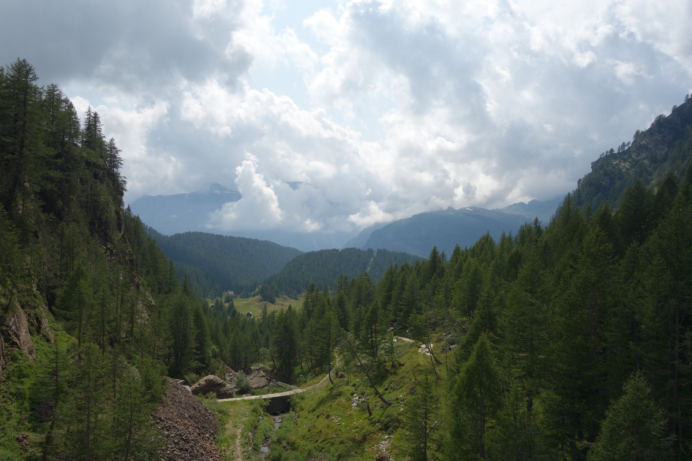

#### Vrijdag 20 augustus
We gaan met Thomas wandelen en willen vanuit Baceno het busje pakken naar Alpe Devero. Wanneer we bij de bushalte staan zien we een lange rij wachtenden, Thomas is er nog niet. We zien ook dat iemand met een hond in de bus geweigerd wordt en we kijken elkaar al aan van dit gaat hem niet worden. Wanneer Thomas net rond het vertrek van de bus aankomt probeert hij het nog, maar ook hij wordt geweigerd. Hij dacht dat het wel kon, met hond in de bus, maar dan zeker niet in de vakatietijd. We rijden met de auto van Thomas naar boven en parkeren daar op een gigantische parkeerplaats. Het is er zeker erg toeristisch! (meer dan in Riale)
Thomas heeft de kaart en stuurt ons een pad op, recht omhoog en weg van de menigte. Het is voor mij een zware klim en het tempo van Thomas is voor mij ook te hard..

 
<em> poehpoeh highijg </em>

Het is er mooi, groen met beekjes en watervalletjes en tijdens het uitpuffen kan ik er van genieten

 
<em> tijdens de klim omhoog </em>

Fido is hier in zijn element en rent van het ene beekje naar de andere. Hij geniet zichtbaar.

 
<em> het groene dal </em>

Kees heeft er aanzienlijk minder moeite mee en ziet de top al, wachtend op de slak...

 
<em> kom je nog? </em>

Van bijna bovenaf is te zien hoe hoog we geklommen zijn..

 
<em> Even stoppen? </em>

We nemen even een pauze om wat te eten en te drinken, Thomas wil snel verder, hij moet op tijd terug zijn. Eenmaal boven gaan we naar rechts, het bruggetje over.

 
<em> onze gids, Thomas </em>

Fido en Trixie nemen even de tijd voor een bad.

 
<em> Even badderen </em>

We lopen door een lieflijk bos, groen en waterrijk.

 
<em> The little green valley </em>

Thomas en Trixie willen even samen op de foto en poseren in de mooie omgeving

 
<em> Thomas en Trixie </em>

Uiteindelijk komen we weer in het toeristische gedeelte uit. 
We nemen een pilsje/colaatje op een terras. 

 
<em> Alpe Devero </em>

We lopen met de stoet mee (het is hier druk), omhoog naar de stuwdam van het meer. Daar gaat Thomas nog met Trixie het meer in. 

 
<em> pootjebaden </em>

Ook Fido neemt een duik, nou ja, tot net onder het buikje. 

 
<em> sportman van het jaar </em>

Dat we in een jong gebergte zitten is wel te zien aan de spitse punten!

 
<em> De bergen om het meer </em>

Het begint een beetje bewolkt te worden.

 
<em>  het meer </em>

en nog een keer het meer, voor we naar beneden gaan

 
<em>  het meer </em>

  We gaan aan de afdaling beginnen en genieten van het uitzicht.
 
 
<em> weer naar beneden </em>
 
Weer in het toeristische stuk kopen we een beter yoghurt met bessen om op te drinken en twee stukken kaas om mee naar huis te nemen. We nemen de toeristische route terug naar de parkeerplaats, Thomas rijdt ons terug naar de parkeerplaats in Baceno, waar onze wegen zich scheiden. Thomas gaat naar zijn werk, wij gaan moe maar voldaan naar huis met Fido, Trixie en de twee stukken kaas!

