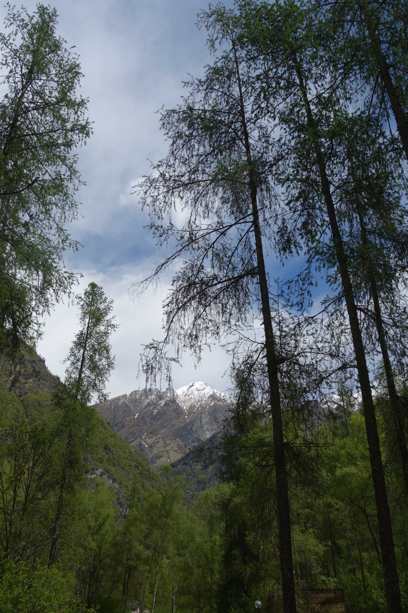
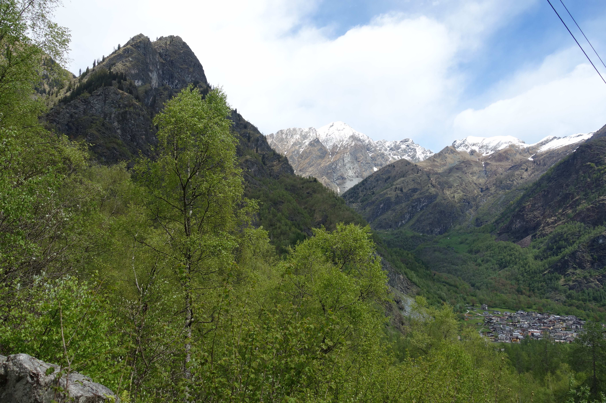
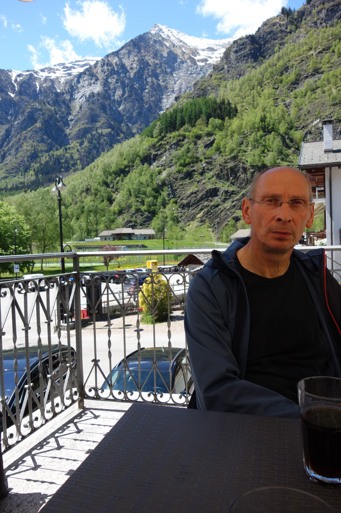

## 25 mei, Antrona Schieranco

 
<em> de route </em>

Na drie weken zonder auto gezeten te hebben (er waren nogal wat tegenslagen en hindernissen bij het invoeren van Klaartje) en daarna een lange regenperiode kunnen we er eindelijk weer op uit! Selwyn had op internet het Antronadal ontdekt en dit wordt onze eerste bestemming weer. We rijden over een steeds smaller wordende weg naar Antrona Schieranco. We willen naar het meer van Antrona. We parkeren Klaartje aan de voorkant van het dorp en steken de weg over,  over de brug het weggetje in naar de het meer, langs de camping (die ik gemaild had om een bungalowtje te huren, maar ze gaan pas 1 juni open). Er gaat een wandelpad naar het meer, dat telkens de haarspeldbochten van de weg afsnijdt. 

 
<em> mooi pad langs rotsen en beekjes </em>

Fido vindt het een leuk pad, er zijn genoeg mogelijkheden om zijn voetjes te laten afkoelen...

 
<em> Fido de walvis </em>

Het is bewolkt en soms zelfs een beetje koud, maar als je door loopt blijf je warm!

 
<em> als het maar niet gaat regenen, iemand heeft haar jas vergeten... </em>

Al gauw zijn we zover geklommen dat we Antrona Schieranco ver beneden ons zien liggen.

 
<em> uitzicht op Antrona Schieranco </em>

Het is eind mei, maar het is hier nog lente, sommige bomen moeten nog volledig uit de knoppen komen.

 
<em> nog geen zomer! </em>

Uiteindelijk komen we bij het meer van Antrona aan. 

 
<em> uitzicht op het meer </em>

In de verte zien we de dam van het volgende meer, een heel stuk hoger dus! 
We beginnen aan het rondje om het meer en hebben een uitzicht op de waterval waar we straks onder door lopen, je kunt de trappetjes zien.
Aan deze kant van het meer (linkerkant) zijn meerdere watervallen. 

 
<em> een van de watervallen </em>

We gaan een tunneltje in en komen op het midden van de rondwandeling om het meer. 

 
<em> het tunneltje </em>

We komen onderweg nog leuke bloemetjes tegen.

 
<em> pluizige bloemetjes </em>

Precies in het middem staat een ruine van een groot huis en we dromen even erover om dit op te knappen, het uitzicht is namelijk schitterend. Leuk om een restaurant of herberg te maken voor wandelaars. Dan bedenken we dat de bevoorrading toch wel erg moeilijk is...
Hier komen we de eeerste medewandelaars tegen, een ouder echtpaar. 

 
<em> het uitzicht </em>

Even verder komen we weer een ruine tegen met een schuurtje. 

 
<em> schattig schuurtje </em>

De wolken zijn ondertussen aan het weggaan en de lucht wordt blauwer. Het wordt mooi weer!

 
<em> weer wat blauwer </em>

We zitten nu onder de dam van het hierboven liggende stuwmeer en het water stroomt hier met geweld het meer in. 

 
<em> het uiteinde van de waterval, de instroom in het meer </em>

We lopen over een bruggetje over deze waterval heen. 

 
<em> het uiteinde van de waterval, de instroom in het meer </em>

We gaan aan een picknicktafeltje wat eten met dit uitzicht:

 
<em> even rusten </em>

lekker in het zonnetje nu

 
<em> picknick </em>

Hier zie je de watervallen die we gepasseerd hebben

 
<em> watervallen eerste helft van de rondwandeling </em>
 
Terwijl wij iets eten gaat Fido in de meditatie-stand: minutenlang staren naar...?

 
<em> zen </em>

We stappen weer op en lopen richting de grote waterval.

 
<em> we zien en horen de waterval al </em>

Na een stevige klim over een bergpaadje en ijzeren trappen, waarmee Fido moeite heeft (open ijzeren treden)
komen we onder de waterval.

 
<em> een beetje nat worden we wel </em>

Nu komen we bij nog meer ijzeren hangpaden, Fido kan nog een stukje ernaast lopen maar uiteindelijk niet meer

 
<em> hier kan Fido nog de ijzeren bodem ontwijken </em>

we zijn de waterval voorbij maar het ijzeren pad loopt door. 

 
<em> net voorbij de waterval </em>

Dan wordt het moeilijk, van voren wordt Fido getrokken, van achteren geduwd en met een heleboel coaching haalt ie het einde van het ijzeren pad...

 
<em> hier kan Fido niet meer langs het pad lopen </em>

We zijn bijna weer bij ons begin van de rondwandeling.

 
<em> De grote waterval rechts  </em>

We lopen hetzelfde pad terug naar Antrona Schieranco. Vlakbij de auto is een cooperative open, meestal kun je daar alleen terecht als je lid bent maar we hebben het al vaker geprobeerd en toen kregen we ook gewoon te drinken, dus we proberen het en krijgen inderdaad een colaatje.

 
<em> op de achtergrond zie je nog een stukje van Klaartje! </em>

Iets eten kan echter niet en op de terugweg rijden we langs de Tigros, doen nog wat boodschappen en rijden tevreden naar huis. 

