## 26 mei Baceno

 
<em> onze route </em>

We rijden wat later naar Baceno, omdat we anders niet kunnen eten (het is of te vroeg of we komen te laat terug voor een restaurant). Rond half 1 zijn we in Baceno, parkeren Klaartje bij de bank en gaan lekker eten bij restaurant "Scarponi". Eerst een kaasplankje, dan een tagliatelle met wildvleesragout en een lekker toetje na. De bediening is erg vriendelijk en vertelt ons (ondanks dat ze zeer afkeurend kijkt wanneer ik cola bij de maaltijd wil, dat is not done in Italië )dat de Italiaanse cola uit Turijn komt, er staat daar blijkbaar een grote toren waar deze Molecola gefabriceerd wordt.Ze laat er een foto van zien. Ook vertelt ze waar de kazen vandaan komen en legt ze uitgebreid de dessertkaart uit.  

 
<em> de Italiaanse cola </em>

Ondanks dat het geen Coca-cola was smaakte het toch goed. Met een tevreden vol buikje gaan we op pad, de route zoeken. En dat valt niet mee: de boeren hebben het pad afgesloten met draad en er lopen koeien dwars over het pad.Ze kijken ons een beetje belangstellend aan. (gelukkig niet teveel interesse)

 
<em> wat komen jullie hier doen? </em>

Na over en onder wat draden geklommen te zijn komen we in het groen terecht.

 
<em> met uitzicht op de bergen </em>

in de verte (diepte) zien we op een gegeven moment een meer liggen. Dit moet dan het meer van Agaro zijn. 

 
<em> het meer van Agaro </em>

nu moeten we weer dwars door de koeien en we sturen onze verkenner vooruit....

 
<em> geen gevaar? </em>

Het pad loopt nu door het bos, langs de rand van de heuvels. 

 
<em> mooi pad met een mooi uitzicht! </em>

Het uitzicht is ook heel mooi, achteraf gezien zien we beneden het pad waarlangs we terug gaan naar Baceno. 

 
<em> het mooie uitzicht </em>

Fido moet weer eventjes zijn voetjes afkoelen...

 
<em> even pootjebaden </em>

we komen bij een breed pad uit langs een weide, het is er mooi en stil

 
<em> het is er zo stil dat er iemand aan het mediteren is </em>

We bereiken een oriëntatiepunt, het Oratorio di Santa Lucia. 

 
<em> het oratorio </em>

Vlak daarbij staat ons droomhuis: een stenen cottage met mooie tuin in een schitterende omgeving en met een mooi uitzicht!

 
<em> Sprookjeshuis </em>

Het brede pad loopt weer het bos in en brengt langs de "orridi":diepe door water uitgemergelde gangen. Het heeft echter de laatste tijd teveel geregend en we kunnen er niet in zonder snorkels. Jammer! We zijn hier 10 jaar geleden geweest met Erika en Thomas en vonden het schitterend. We kunnen van het eerste stukje een foto maken.

 
<em> de ingang </em>

We gaan het pad weer op en lopen erom heen en komen bij de uitgang uit. 

 
<em> de uitgang </em>

we nemen ons voor terug te komen in de zomer, dan kunnen we er zeker in en is het ook lekker koel!
we lopen een eindje door en horen een donderend geluid: we komen bij de Marmitte dei Giganti, een reusachtige stroomversnelling in de rivier de Toce. 

 
<em> met een razend kabaal stort het water naar beneden </em>

De kleuren zijn heel mooi. Op de brug kun je je niet verstaanbaar maken, zoveel geraas is er.  

 
<em> vanuit het bruggetje </em>

ik kan niet genoeg krijgen van de kleur van het water. (we hebben hier nog veel meer foto's van)

 
<em> groen-blauw </em>

We drinken wat en laten het natuurgeweld achter ons. We raken het pad kwijt, het schijnt dood te lopen in een tuin van een huis. We gaan weer terug naar het grote pad (dat eigenlijk onze route niet is) en besluiten dat maar te volgen. We steken de Toce weer over. 

 
<em> de oversteek </em>

Even daarna zien we de route weer, we hadden toch door de tuin gemoeten. 

 
<em> mooie bloemetjes in het veld </em>

via een bospad komen we uiteindelijk bij de kerk van Baceno uit. Deze staat hoog op een heuvel, we lopen eromheen om hem van binnen te bekijken. 

 
<em> de kerk van Baceno </em>

wanneer we omlopen, naar de ingang, zien we dat de kerk gewijd is aan Sint Christoforus, de beschermheilige van reizigers.

 
<em> Over dat wiel weten we nog niets, stond ook op de andere kant van de kerk </em>

We denken Fido even te kunnen parkeren om de kerk binnen te gaan, maar al na twee minuten horen we een protesterend geblaf en Kees gaat maar weer naar buiten om het eenzame kind gerust te stellen. In de kerk is een priester aan het fluisteren met een vrouw en het is moeilijk foto's te maken, die klik klinkt behoorlijk hard...

 
<em> de kerk van Baceno van binnen</em>

Het interieur is een complete verrassing! Heel rijk beschilderd, heel groot ook en blijkbaar ook waardevol: stukken zijn afgezet met alarmsystemen. 

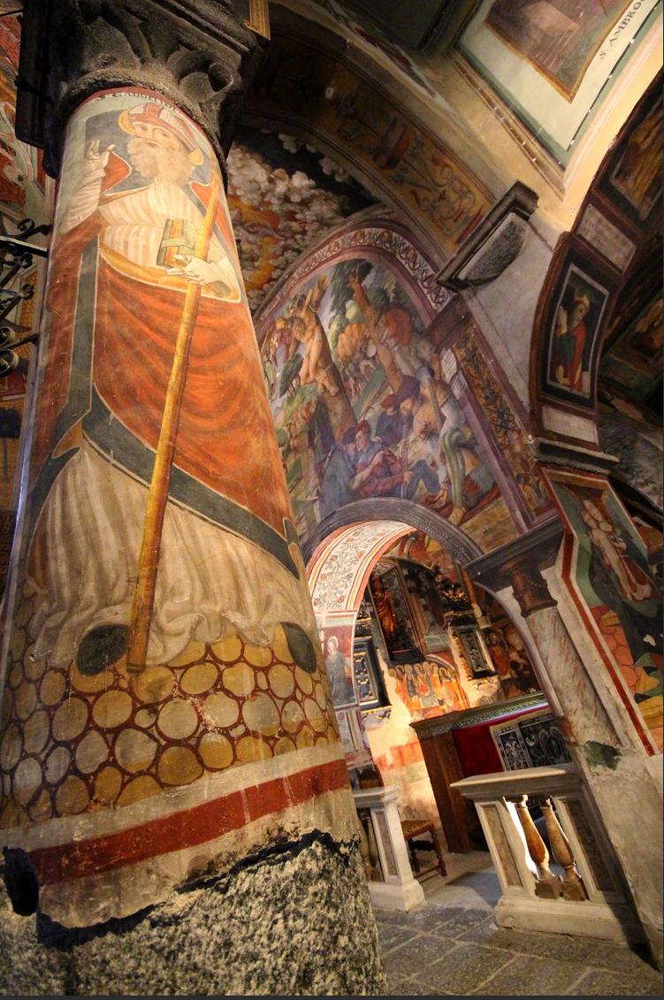 
<em> de kerk van Baceno </em>

Bij het altaar is een muurschildering over de hele muur

 
<em> de kruisiging </em>

Ook Adam en Eva ontbreken niet, de slang ziet er wel heel erg vrouwelijk uit...

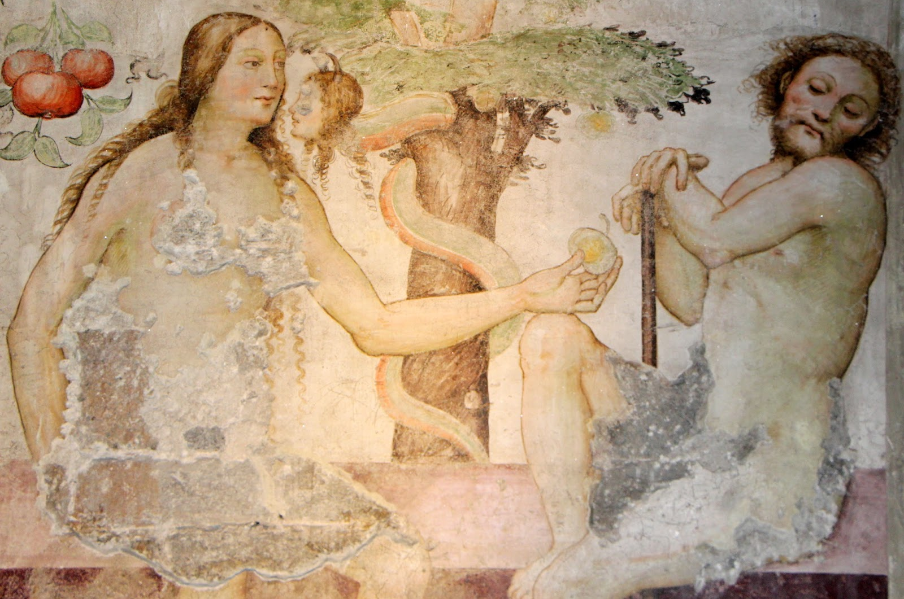 
<em> de verleiding </em>

Bij de deur nog een fantastische schildering van een demon:

 
<em> de kerk van Baceno </em>

Plots wordt duidelijk dat de kerk in gebruik is, de mensen in een zijkapel kijken gestoord op en het is tijd om eruit te gaan. 
we lopen het stadje weer in en komen weer bij Klaartje. Het was een geweldige wandeling die we zeker nog gaan overdoen!

## 21 Oktober 
En inderdaad hebben we het overgedaan: op 21 oktober doen we deze wandeling samen met Selwyn. 's Morgens regent het, maar volgens Selwyn is dat juist mooi voor de foto's. Ik hoop echter op mooier weer! Selwyn rijdt ons naar Baceno toe. We beginnen nu bij de kerk. Omdat er een begrafenis is besluiten we de kerk als laatste te bekijken. We gaan onder het poortje door naasr de kerk en lopen het pad op richting de Orridi, in de hoop dat we er nu in kunnen zonder duikersuitrusting! 

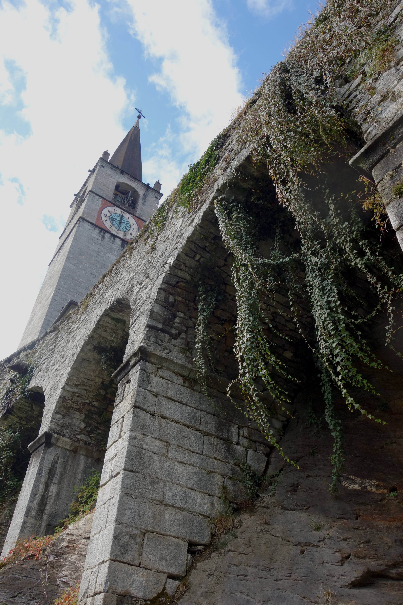 
<em> de kerk van Baceno op een hoge voet </em>

wanneer we het bos in komen schrikt Selwyn, er kruipt een beestje over het pad. Het is de vuursalamander die zich langzaam voortbeweegt. 

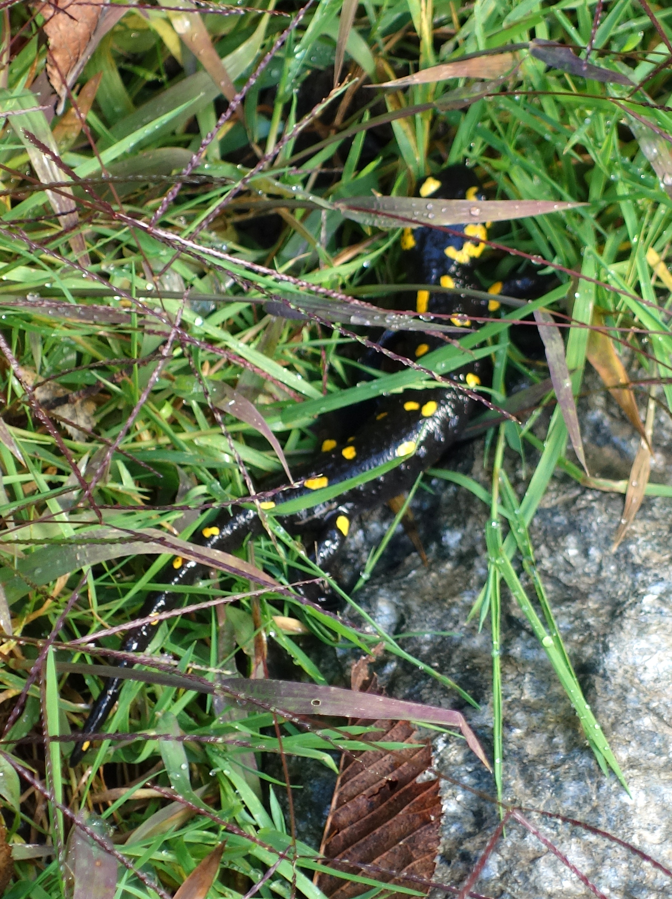 
<em> de vuursalamander </em>

Selwyn zoekt het nog op:De vuursalamander is een van de grootste Europese amfibieën en heeft een onmiskenbaar kleurpatroon; een zwarte kleur met gele vlekken en strepen. De vuursalamander heeft een gedrongen bouw en de ronde staart is relatief kort. De afstekende kleuren dienen om andere dieren af te schrikken; het is een vrij giftige soort. De ontwikkeling van de vuursalamander is bijzonder omdat geen eieren worden afgezet, maar deels ontwikkelde larven levend ter wereld worden gebracht. Soms komen ze zelfs volledig ontwikkeld ter wereld, wat uitzonderlijk is voor amfibieën. 
Hij kruipt langzaam weg maar een meter verder zien we er nog één!
We lopen door en komen op een open stukje uit met mooi uitzicht op de omringende bergen. Het is nog steeds wat mistig maar de lucht is inmiddels blauw geworden.

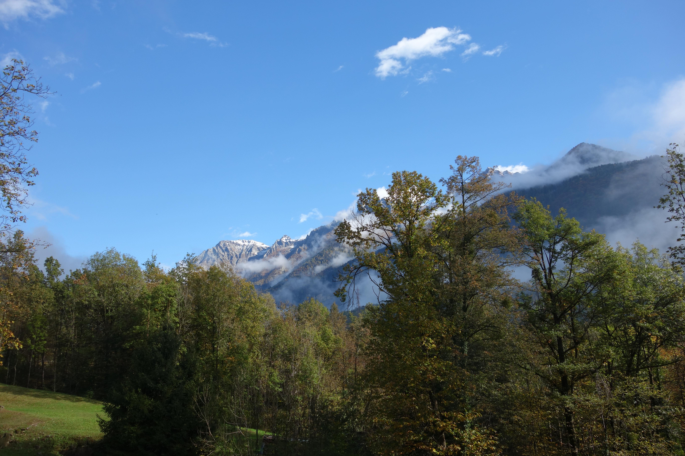 
<em> mooi uitzicht </em>

Selwyn zet er flink de pas in!

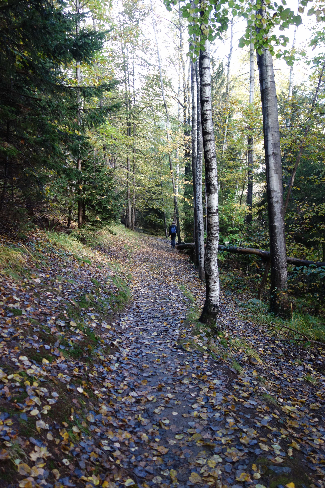 
<em> follow the leader </em>

We komen bij een stuk bos met 3 watervallen, vlak bij de ingang van de Orridi.

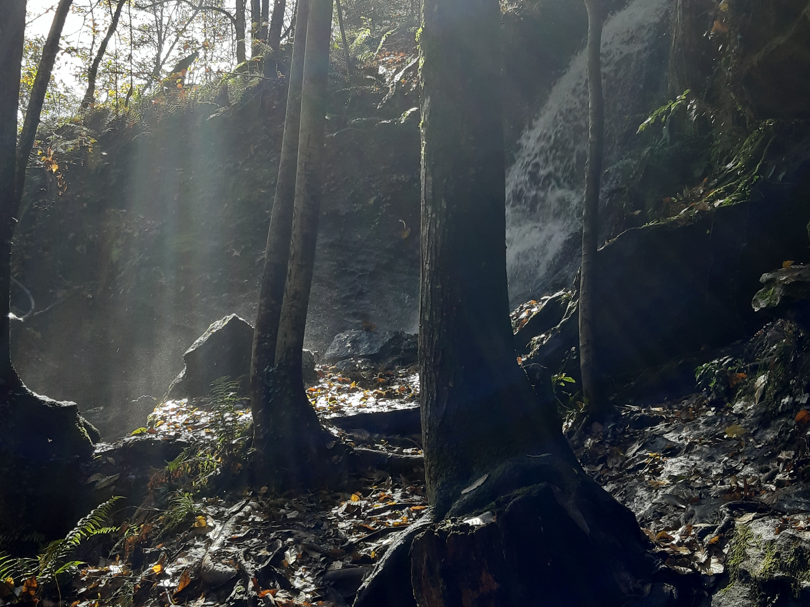 
<em> diffuus licht tussen de bomen </em>

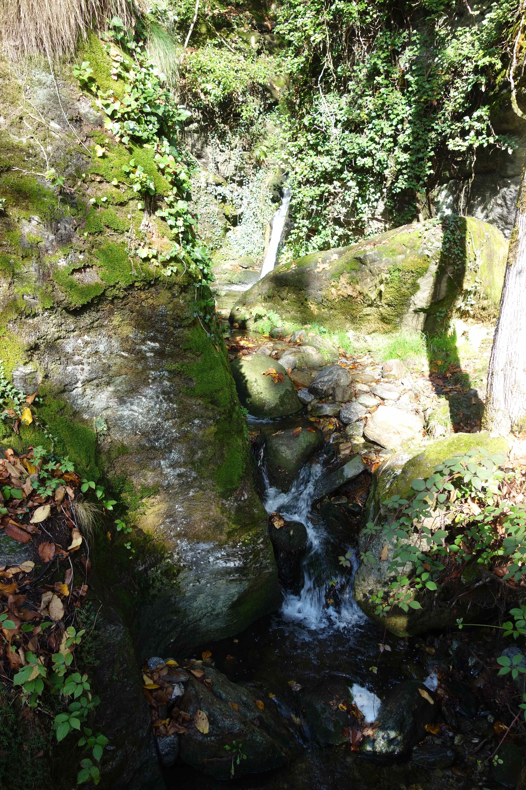 
<em> klein watervalletje </em>

we komen bij de ingang van de Orridi en zien de trappen van ijzer. Terwijl we ons al af zitten vragen hoe Fido hier naar boven komt, loopt hij al zelf de trap op!

 
<em> de Orridi </em>

We gaan de kloof in, uitgesleten ooit door kolkend water. 

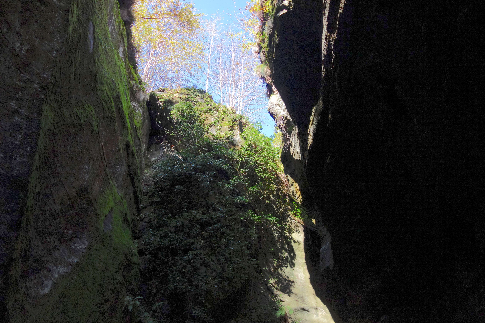 
<em> boven is het licht, beneden donker </em>

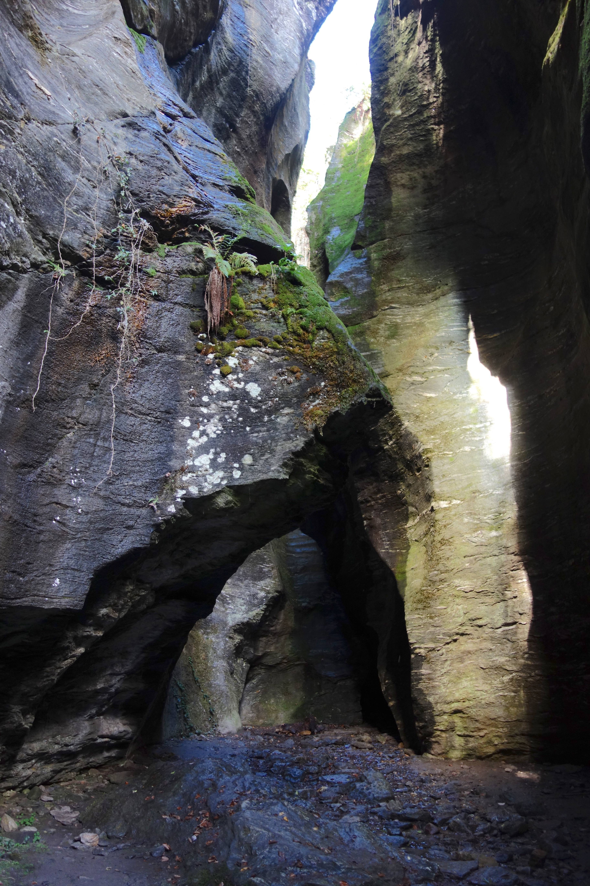 
<em> in de kloof </em>

Duidelijk is te zien hoe het water in de kloof rondgekolkt moet hebben...

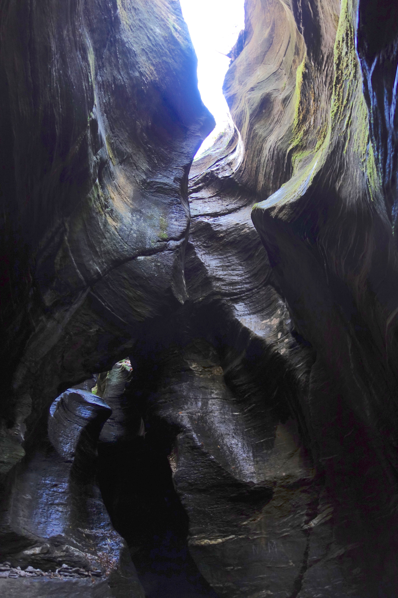 
<em> erosie </em>

Uiteindelijk weer uit de kloof, Fido is zeer dapper over de open trappen gegaan en wordt beloond, gaan we naar de brug over de rivier. Het water stort hier zo hard naar beneden dat we geen gesprek kunnen voeren, zoveel lawaai is er. 

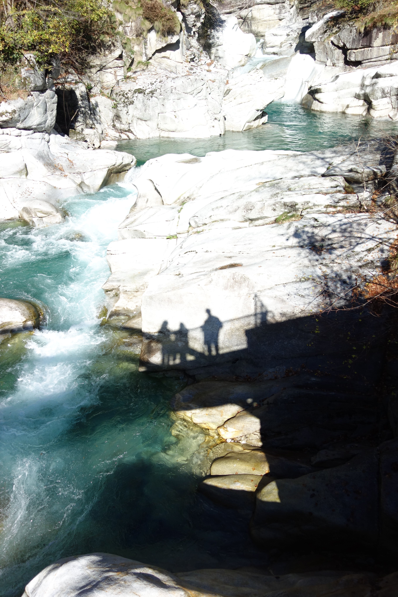 
<em> met zijn drieen op de brug </em>

We vervolgen onze weg over de brug, de berg op. Bij een uitkijkplaats op het water eten we de pizza van de vorige dag. 

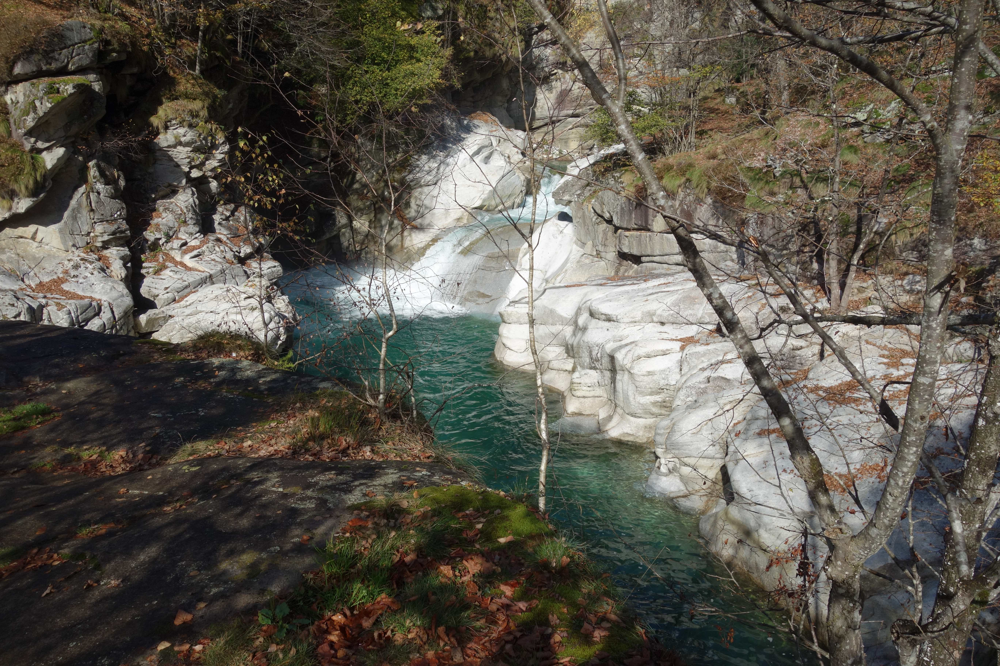 
<em> mooi uitzicht zonder al teveel lawaai </em>

Onze Boeddha gaat ondertussen in meditatie en gaat in een diepe trance terwijl hij de schaduwen en vallende blaadjes observeert...

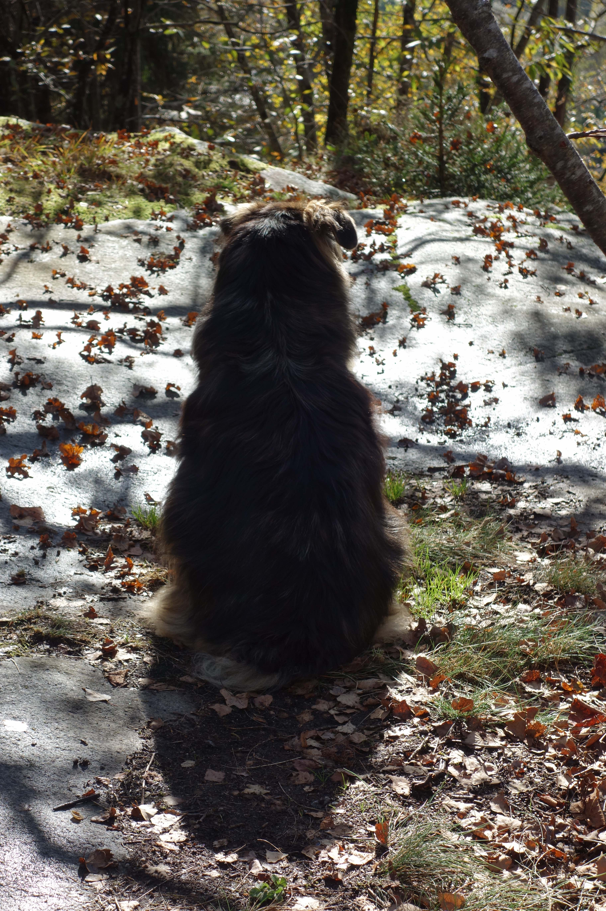 
<em> Fido de Boeddha </em>

We gaan de berg op en daarna weer naar beneden, terug naar de rivier, over een andere brug, deze rode.

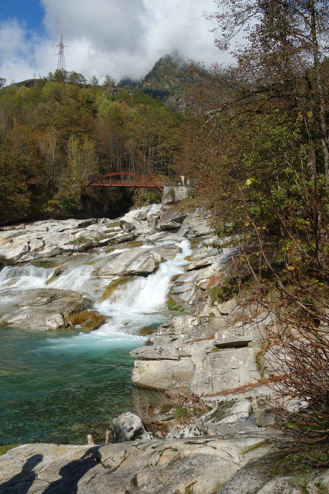 
<em> de volgende brug </em>

