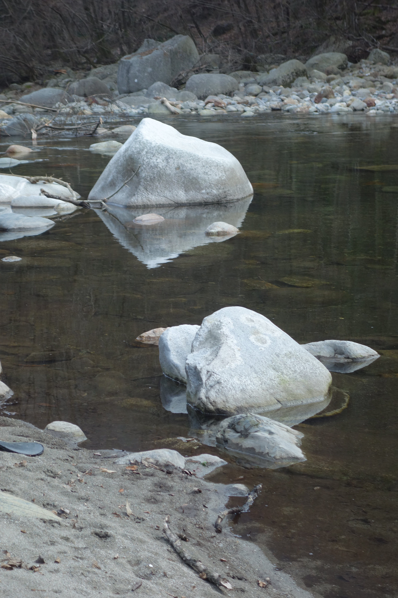
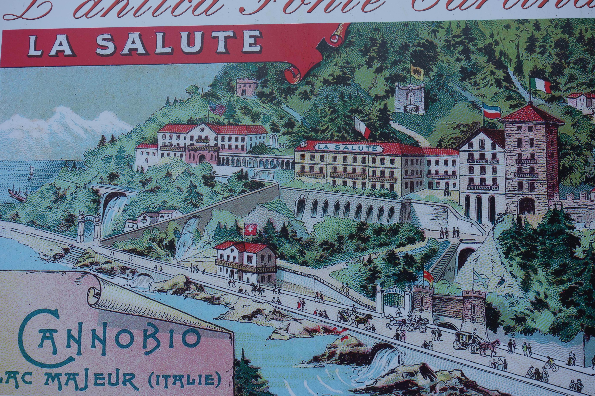
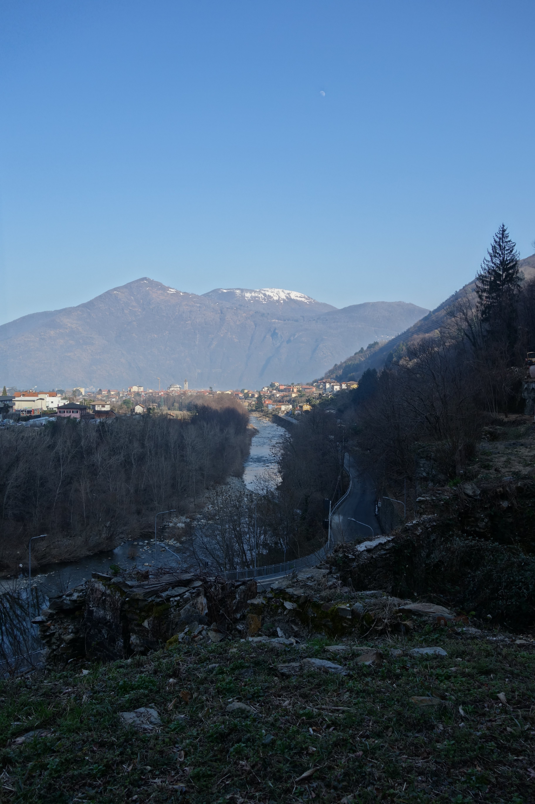
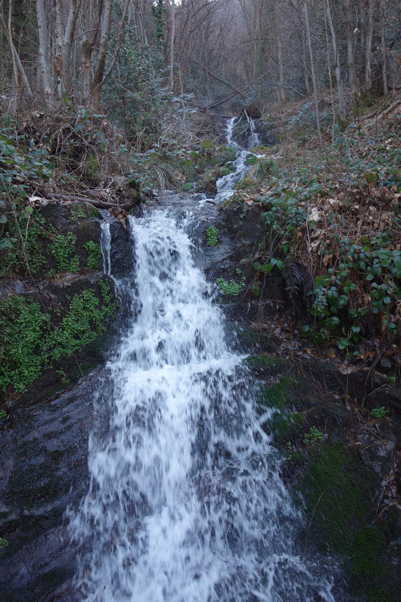
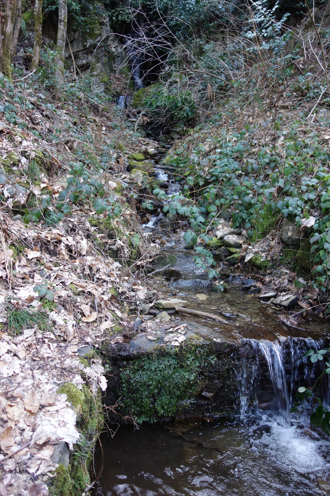
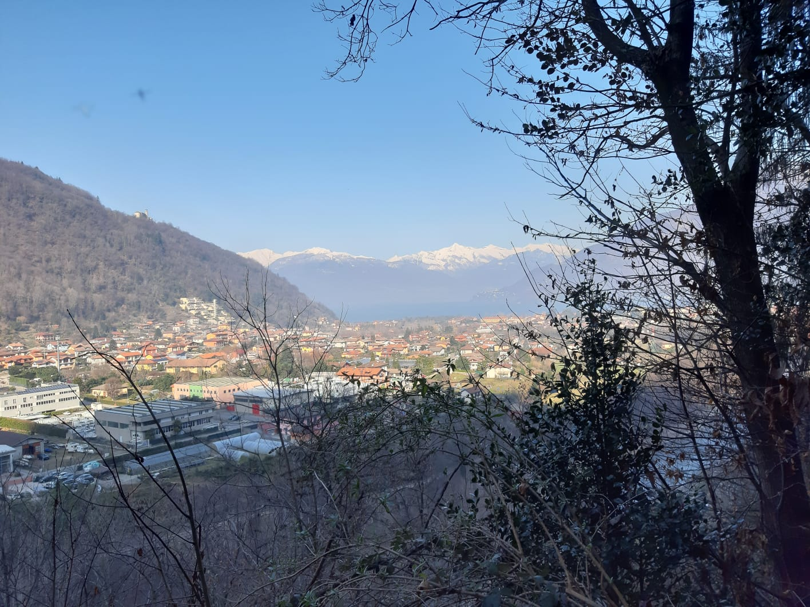
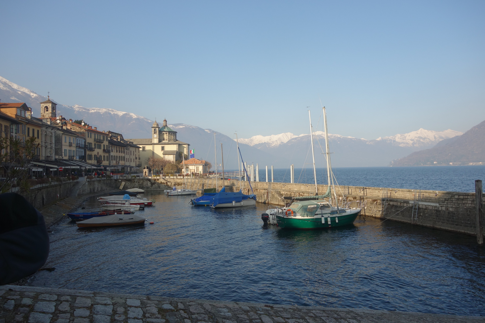

## Cannobio
#### 21 februari 2021

 
<em> onze oorspronkelijke route </em>

Cannobio is iets meer dan een uur rijden, ligt aan het Lago Maggiore, net voor de Zwitserse grens. 
Omdat Fido het steeds beter doet in de auto, in de achterbak is hij nog niet ziek geworden, durven we nu wat verder te rijden.
We parkeren Klaartje aan het begin van het dorp en lopen het dorpje door richting het riviertje de Cannobino. De route begint in het park en daar staat een groot bord met dit plaatje:

 
<em> ohoh </em>

we denken al van :heel dat stuk gereden en nu mag de hond er niet in. We vragen het aan de bezoekers , de eerste praat Frans en weet van niets, de tweede is een Italiaan die zegt dat het volgens hem wel mag... Wij hebben zoiets van :als het van deze Italiaan mag, mag het van alle Italianen, toch? 
Even verder staat nog zo'n bord, nu met de woorden: cane al guinzaglio, met de nummers van de wetsartikelen.Hoewel we het niet uit kunnen spreken begrijpen we dat dit hond aan de lijn betekent en opgelucht lopen we door, in de veronderstelling dat de route het park spoedig zal verlaten en dat we dan Fido los kunnen laten.

 
<em> langs het riviertje </em>

Het pad blijft echter breed en geasfalteerd en langzaam beginnen we te begrijpen dat dit voor grote drommen toeristen bedoeld is. Niet echt mooi vinden we.
We komen bij een hangbrug en daar wordt Fido's angst voor bruggen echt duidelijk: wanneer er van de andere kant ook iemand komt gaat de brug wiebelen en Fido gaat op zijn kniëen verder. Belachelijk beestje!

 
<em> och gaarrum </em>

Gelukkig vinden we daarna een klein paadje langs het water (het brede pad gaat niet eens langs het water en Fido is de brug alweer vergeten!

 
<em> da's beter! </em>

we volgen het riviertje Cannobino via het smalle paadje, waarschijnlijk het oorspronkelijke paadje, en zien in de verte het brede pad nog liggen. 

 
<em> langs het riviertje </em>

We moeten bij de brug omhoog, naar het brede pad, maar kunnen na de brug weer afslaan naar het smalle paadje.

 
<em> oud bruggetje </em>

Uiteindelijk bereiken we het eindpunt van de wandeling: het kerkje van Santa Anna bij de kloof.

 
<em> kerkje van Santa Anna </em>

Helaas is het kerkje gesloten evenals het grotrestaurant. Er staan wel bankjes,lekker in de zon en daar picknicken we onder toeziend oog van Fido.

 
<em> wachtend op het blikje tonijn... </em>
  
onder en naast het kerkje is een ravijn waar het water hard doorheen stroomt

 
<em> kloof </em>
  
De route gaat nu heel saai dezelfde weg terug maar we zien op de wandelkaart (met dank aan Selwyn en Coline) dat er bij de stenen brug een pad omhoog gaat,
langs allerlei bronnen, richting Cannobio en we besluiten die te nemen. Fido neemt nog een bad.

 
<em> hij moet toch wel schoon zijn! </em>

We lopen dus het pad terug tot aan de stenen brug

 
<em> net ijs,toch? </em>

We moeten bij de stenen brug een ijzeren, open trap op om het pad te bereiken en Fido heeft daar psychische problemen mee...onder permanente coaching komt hij toch boven, trede voor trede. Het pad gaat nu best steil omhoog, we komen een bord tegen van hoe het er hier vroeger uitzag.

 
<em> de vele bronnen en thermen van Cannobio (toen) </em>

We hebben nu van de andere kant en veel hoger uitzicht op het riviertje de Cannobino

 
<em> in de verte Cannobio </em>

Eenmaal boven is er een mooi bospad met verschillende watervallen.

 
<em> een van de vele watervallen </em>

Eigenlijk vinden we dit pad veel mooier dan het zo aangeprezen pad dat we op de heenweg hebben gehad!

 
<em> een van de vele watervallen </em>

We naderen Cannobio weer

 
<em> uitzicht op Cannobio </em>

Terug in Cannobio lopen we via de smalle straatjes naar de haven en boulevard van Cannobio

 
<em>haventje van Cannobio </em>

We kijken of er op de boulevard iets open is, maar nee (het is zondag). Wanneer we teruglopen naar de auto komen we langs een bakker annex koffietentje. We nemen een koffie en een cola en een heerlijke koek. Wanneer we daarna bijna weer terug zijn bij de auto ontdekt Kees dat ie zijn rugzak heeft laten staan in het koffietentje. We lopen vlug terug en gelukkig staat ie er nog! 
We rijden weer langs het Lago Maggiore terug naar huis, een mooie dag!
