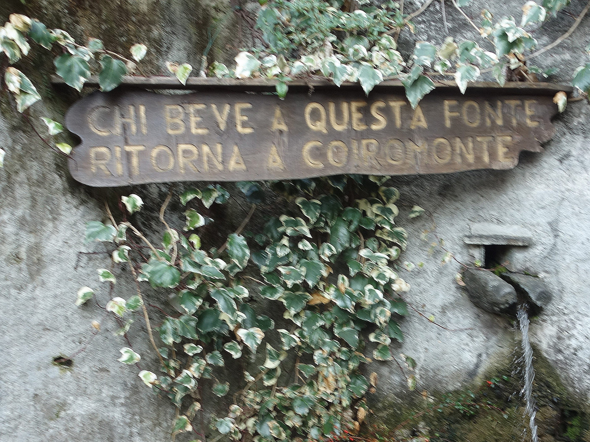

## Coiromonte
#### 28 februari
We vertrekken vandaag met twee auto's via Armeno naar Coiromonte. In de eerste auto zitten Thomas en Erika en hun drie honden Trixie, Kyra en Milo. Wij met zijn drieen in Klaartje. Het is een echte uitdaging voor Klaartje om via de haarspeldenweg naar boven te komen in Coiromonte. Coiromonte is een dorpje dat lange tijd, na het verdwijnen van de industrie, verlaten was. Later werd het dorpje de vestigingsplaats van aanhangers van Sir Aurobindo en Mira Alfassa (the mother). Coiromonte wordt door hen Mirapuri genoemd. (City of peace and future man). Coiromonte heeft officieel 52 inwoners waarvan 14 buitenlanders (wel uit Europa). 
Na enige moeite parkeren we de auto's aan de voorkant van het dorp en lopen het dorpje in. We drinken nog even bij de bron.De foto is niet scherp, maar het ging mij om de tekst: Chi beve a questa fonte ritorna a Coiromonte oftewel wie uit deze bron drinkt keert terug naar Coiromonte.

 
<em> tekst bij de bron </em>

Na de flessen gevuld te hebben lopen we door en komen bij het kleine winkeltje, gerund door een Duitse vrouw, waar we wat stukjes pizza kopen.Even verderop lopen we langs het plaatselijke café dat open is en we nemen ons voor daar straks iets te drinken, op de terugweg.

 
<em> straks koffie/cola! </em>

We lopen een best wel steil pad op en al spoedig wordt het uitzicht mooi. Het doel van de wandeling wordt de 3 Montagnette genoemd, s heuveltoppen naast elkaar met uitzicht op het Lago Maggiore

 
<em> mooi he? </em>

Ook komen we de eerste stukken sneeuw tegen, waar Fido lekker in gaat rollen.

 
<em> de eerste sneeuw </em>

Verder omhoog komen we langs de witte berken

 
<em> Fido sluit de rij </em>

Voorbij de berken komen we in een open gebied 

 
<em> kaal, met af en toe een boom </em>

en wie grijpt er weer zijn kans om te badderen?

 
<em> of ie hier echt schoon van wordt... </em>

Frisgewassen loopt Fido met ons verder omhoog, naar de top

 
<em> de ferme stapper </em>

Nog net niet boven zien we het Lago Maggiore al liggen

 
<em> Trixie in actie </em>

Terwijl we verder omhoog lopen blijkt Kyra (te ver) weggelopen te zijn, er wordt naar haar gezocht en geroepen.

 
<em> nog een ferme stapper </em>

Terwijl er naar Kyra gezocht loop besluit ik met Fido een vaste plaats in te nemen op de top en loop verder omhoog

 
<em> uitzicht aan de "verkeerde kant" </em>

Ik loop over het pad naar boven met Fido (eigenlijk weer om de heuvel heen naar beneden blijkt later) terwijl de rest binnendoor gaat en daar naar Kyra zoekt, ik loop me vast in de sneeuw...en ben de rest kwijt. Omdat ik een beetje verloren kijk, spreken twee mensen me aan en vertellen dat recht omhoog mensen roepen om een Kyra (in het Engels). Ik weet dus dat ik recht omhoog moet om de rest weer te vinden.

 
<em> samen met Fido op stap </em>

 
<em> na deze bocht gaat het pad naar beneden </em>

Fido en ik gaan nu recht omhoog, een beetje zwaar door de sneeuw naar de top van de eerste heuvel, daar een prachtig uitzicht!

 
<em> Het Lago Maggiore </em>

Ik besluit op deze top te wachten
