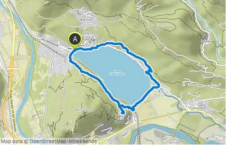
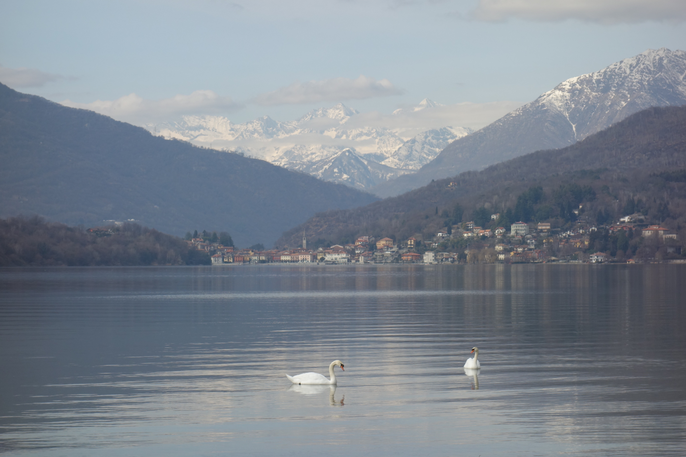

## Mergozzo
#### 19 februari
    

 
<em> de route </em>
 

Rond 12 uur parkeren we Klaartje (ons Volvootje) in Mergozzo, dichtbij Via Montorfano. Omdat Fido na een kwartier rijden op de achterbank gaat kotsen hebben wij hem nu op een deken in de achterbak en dat gaat goed!
We nemen het pad "sentiero azurro" dat ons langsonder de granietberg Montorfano leidt en langs het meer van Mergozzo.

 
<em> de goede route gevonden </em>

 
<em> het stenen pad </em>

Onderweg lezen we dat dit pad werd gebruikt om de grote blokken graniet van de Mont Orfano te vervoeren naar het water. 
De granietblokken werden op stevige houten karren gezet (De Fiatjes waren er toen nog niet). 
Het graniet werd tot in Rome toe gebruikt, vervoerd over het water,vandaar het kanaal tussen het Mergozzomeer en het Lago Maggiore. 

 
<em> uitzicht op Mergozzo </em>

Bij een watervalletje  (waar Fido eerst vrolijk in baddert) zien we de eerste sneeuwklokjes van dit jaar. Het valt even niet mee om er een foto
van te maken, Fido komt elke keer met zijn neus tegen de camera en vertrapt bijna, lichtvoetig als ie is, de sneeuwklokjes.

 
<em> het eerste sneeuwklokje voor ons </em>

Op dit punt van het pad zien we in de verte het Lago Maggiore liggen. 

 
<em> in de verte Lago Maggiore </em>

we naderen nu het einde van het sentiero azurro pad

 
<em> de dappere stappers </em>

we komen nu aan de zuidkant van het meer, vlakbij het treinstation Verbania-Pallanza. 
We verlaten het pad, lopen door een spoortunnel en komen op het strand uit. 

 
 <em> zuidkant van het meer </em>

In vroegere tijden was het Mergozzomeer een onderdeel van het Lago Maggiore maar door de slibafzetting van de rivier de Toce is het honderden jaren geleden een zelfstandig meer geworden. Marian (dank!) liet nog weten dat het water in het Lago di Mergozzo zonder twijfel het schoonste en zuiverste water is in Italië. 

via het strand komen we op het terrein van een camping, via paadjes en hekken weer op een andere camping

 
<em> verste punt van de route </em>

 
<em> een legpuzzelwaardig plaatje </em>

Fido gaat nog even gauw in bad voor we weer omhoog gaan en het meer verlaten.

 
<em> de schone bader </em>

we moeten nu een weg op en ergens langs de rechterkant het pad zien te vinden dat ons weer naar Mergozzo leidt. 
 We lopen langs de linkerkant van de weg, omdat daar een afgeschermd fiets/voetgangerspad is. Wanneer we het pad zien aan de rechterkant van de weg (denken we) moeten we nog een stukje doorlopen tot de afscherming afgelopen is en dan teruglopen over de weg. We nemen het pad omhoog. Dit is niet zo'n recht pad zoals aan de overkant, het is smal en kronkelig en gaat van waterval naar waterval. Fido kan zijn geluk niet op!

 
<em> Boselfje met haar hond? </em>

Kees zit duidelijk elfjes zegt hij, ik zie ze niet...

 
<em> Fotograaf met assistent </em>

Het lijkt mij meer iemand die een foto neemt met de regisseur op de achtergrond...

 
<em> watervalletje </em>

om de 50 meter is wel een waterval, dus we wandelen met het continue geluid van het geklater van water, heel mooi, het is net de Efteling!
We stoppen ergens bij een watervalletje en eten en drinken wat.

 
<em> bij onze picknickplaats </em>

 
<em> nog een watervalletje </em>

Het pad wordt naar het einde toe steiler (naar beneden) en gladder, een beetje glibberen..

 
<em> een mooi plaatje </em>

aan de overkant zien we de Monte Orfano, waar we op de heenweg langsgelopen zijn

 
<em> Monte Orfano </em>

Van het glibberpad af komen we in Mergozzo uit en lopen over de boulevard langs het meer weer het stadje in

 
<em> Mergozzo </em>

In Mergozzo zoeken we nog naar een gelegnheid om iet te eten of te drinken. Er is alleen een Michelinrestaurant open en daar mogen geen honden naar binnen, dus besluiten we maar Klaartje te gaan zoeken. 

 
<em> de straatjes van historisch Mergozzo </em>

we lopen door de smalle straatjes op zoek naar het kerkje als oriëntatiepunt om de parkeerplaats te vinden.De huizen zijn gebouwd met de ferme ossola steen en elk huis leunt op zijn buurhuis om zo elkaar te versterken. Tussen de huizen lopen smalle staatjes en trappetjes.
we komen nog een mooi binnenplaatsje tegen

 
<em> mooi binnenplaatsje in Mergozzo </em>

Eindelijk zien we het kerkje en daarna het straatje omhoog naar de parkeerplaats

 
<em> treden omhoog naar de parkeerplaats </em>

Moe maar tevreden rijden we weer naar Agrano. Dit was zeker één van de mooiste wandelingen die we ooit gedaan hebben!
