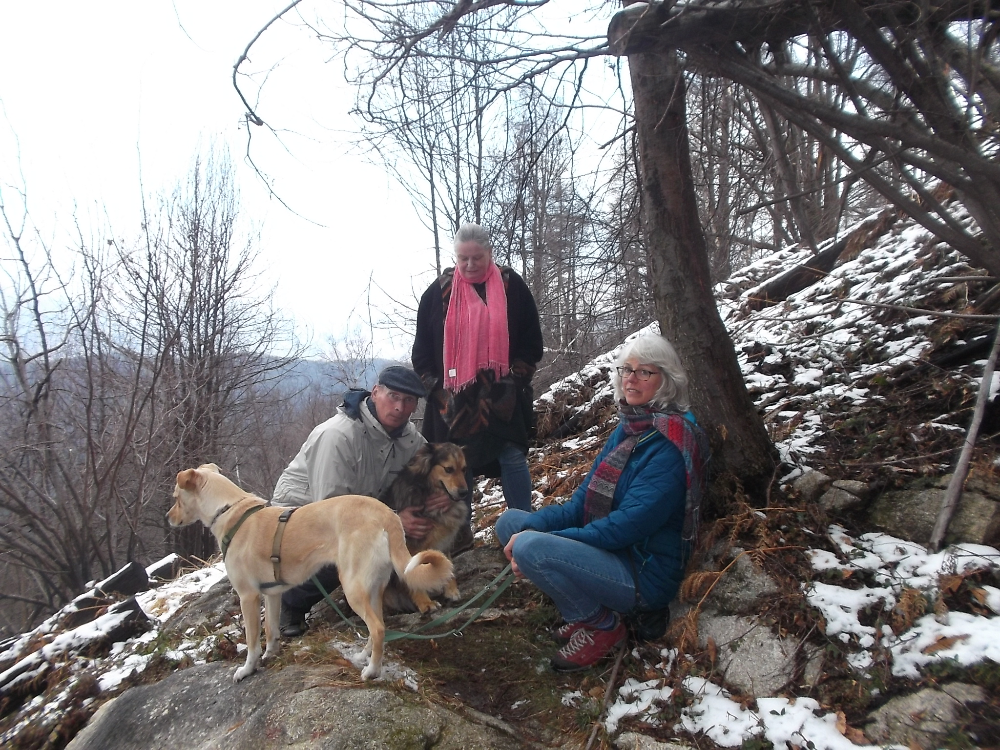

## Santuario Della Modonna Di Luciago
#### 7 maart
We rijden weer met twee auto's via Armeno naar het Santuario della Madonna di Luciago (net voorbij Cheggino) en parkeren de auto bij het Santuario. Dit is op weg naar de Mottarone, het adres is dan ook via Mottarone. 
Er is een restaurant, helaas gesloten. 
We nemen het pad links van het reataurant, eerst nog breed maar geleidelijker smaller en smaller en nu bedekt met sneeuw. 

 
<em> meteen een mooi uitzicht! </em>

Het pad loopt echt op het randje van de kam en het is niet gemakkelijk, vanwege de sneeuw.

 
<em> een beetje koud ook </em>

In de verte zien we "ons" meer liggen, het Ortameer met de drakenkop en het eiland

 
<em> ons meer </em>

 
<em> Erika in de sneeuw </em>

Het licht valt heel mooi op de besneeuwde toppen, daarachter moet de Mottarone liggen

 
<em> zonlicht op de besneeuwde berg  </em>

Fido voelt zich wel lekker in de sneeuw....

 
<em> Fidootje </em>

Van hieruit zien we zelfs Pella liggen, het dorpje aan de overkant van het meer waar we ooit zo lekker gegeten hebben.

 
<em> Pella aan de overkant van het Ortameer  </em>

Fido wandelt door..

 
<em> Fidootje </em>
 
<em> groepsfoto (Thomas is de fotograaf)  </em>
  
