## Riale
#### 31 augustus-3september
Op dinsdag 31 augustus rijden we richting Riale om daar 3 nachten te verblijven in een hotel, Aalt Dorf. Nog in Omegna worden we aangehouden dooe de cabanieri. Als blijkt dat we Nederlanders zijn hebben ze eigenlijk al spijt...en hoe komen we aan die Italiaanse auto? Gehuurd? De papieren worden gecheckt, ook Kees zijn gloednieuwe Italiaanse rijbewijs. Alles in orde! Eentje loopt nog om de auto en ziet dat Fido los op de achterbank zit. OhOh, dat mag niet. Voor deze keer geen boete (teveel complicaties denk ik), de volgende keer wel is de dreiging. We kopen iets verder op een riem die in de gordelbevestiging kan. We zijn rond 1 uur in de middag bij het hotel, checken in en nemen een lunch. 
####De eerste wandeling
Daarna lopen we de route naar Lago Toggia, die direct bij het hotel begint. 

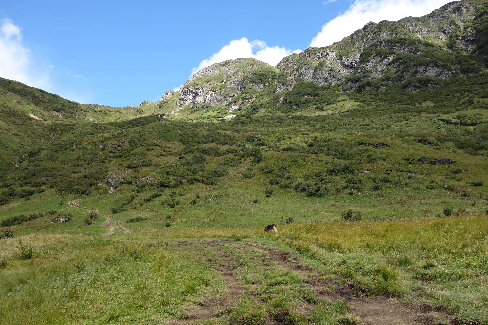  
<em> begin van de route </em>

We kunnen de haarspeldbochten afsnijden en de steile tussendoortjes doen, dit scheelt vele meters volgens ons, is wel zwaarder.

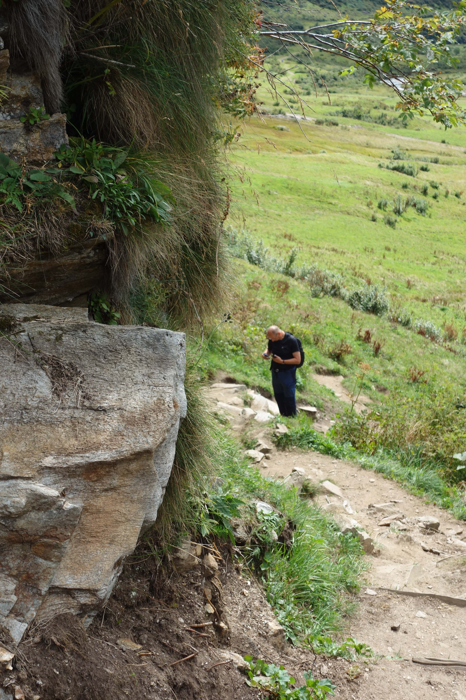 
<em> binnendoor omhoog </em>

we komen onderweg vele mooie bloemen tegen, onder andere deze "strobloem" die in de zon wel zilver lijkt.

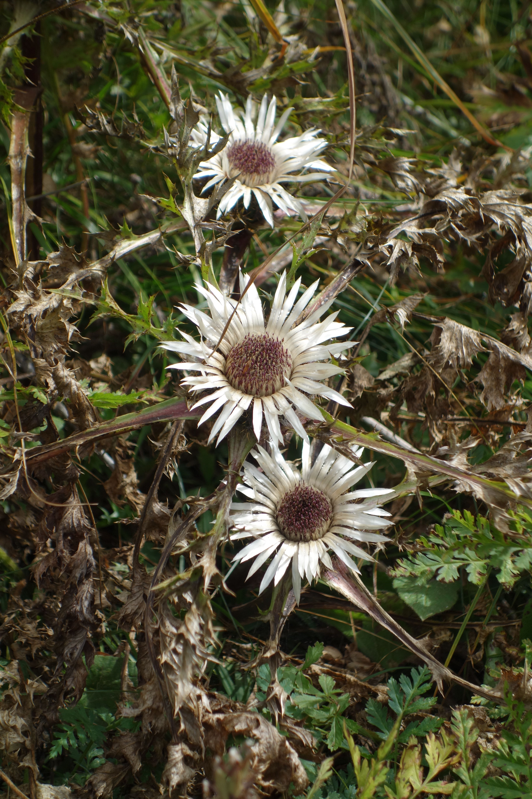 
<em> strobloemetjes </em>

We beginnen al aardig te klimmen en kijken nu op het Lago Morasco. Het kerkje wordt ook steeds kleiner.

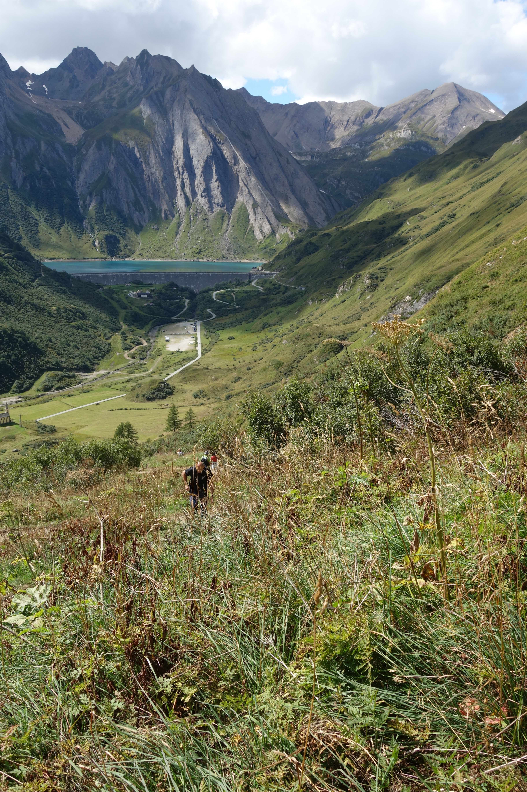 
<em> uitzicht halverwege </em>

Af en toe volgen we een stukje van de officiele route, totdat we weer binnendoor omhoog kunnen. In de bochten van de echte route staan stenen bogen, waar mensen op kunnen leunen om van het uitzicht te genieten. 

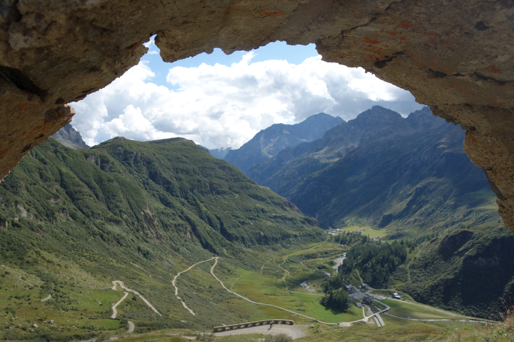  
<em> uitzicht op ons hotel, op hondshoogte gekeken </em>

Fido kiest voor een ander pad dat parallel met het echte pad loopt, waardoor we langs een mooi vennetje komen

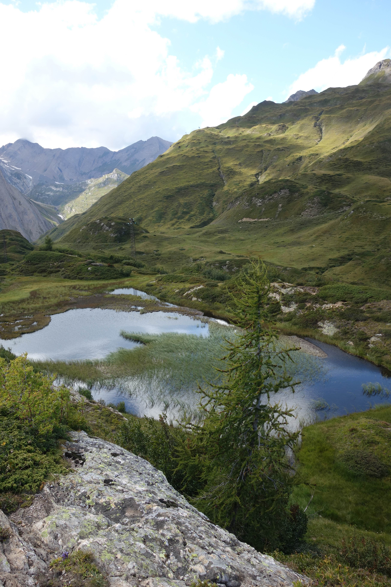 
<em> vennetje </em>
  
Hier zien we ook de distel (in gedroogde versie)

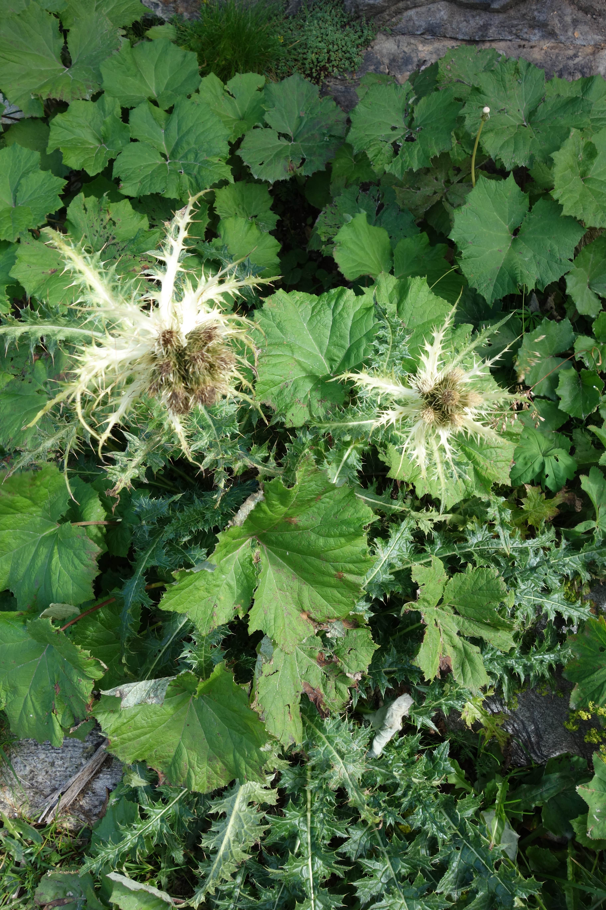 
<em> distel </em>

we zijn bijna boven en kijken nu een ander dal in.

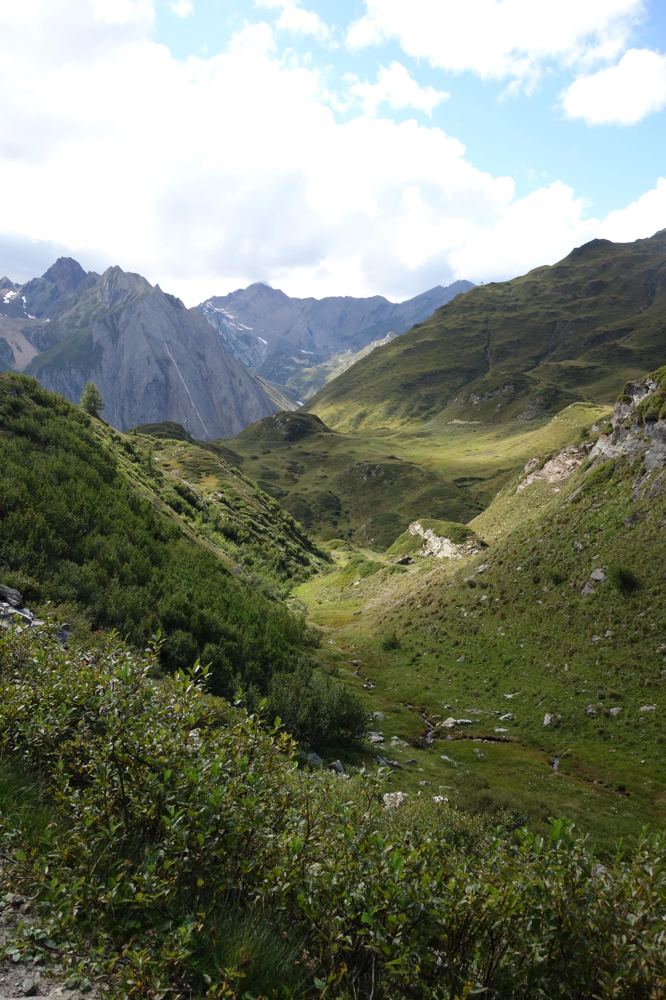 
<em> how green is my valley </em>

We klimmen nog iets en zijn bijna bij het meer.

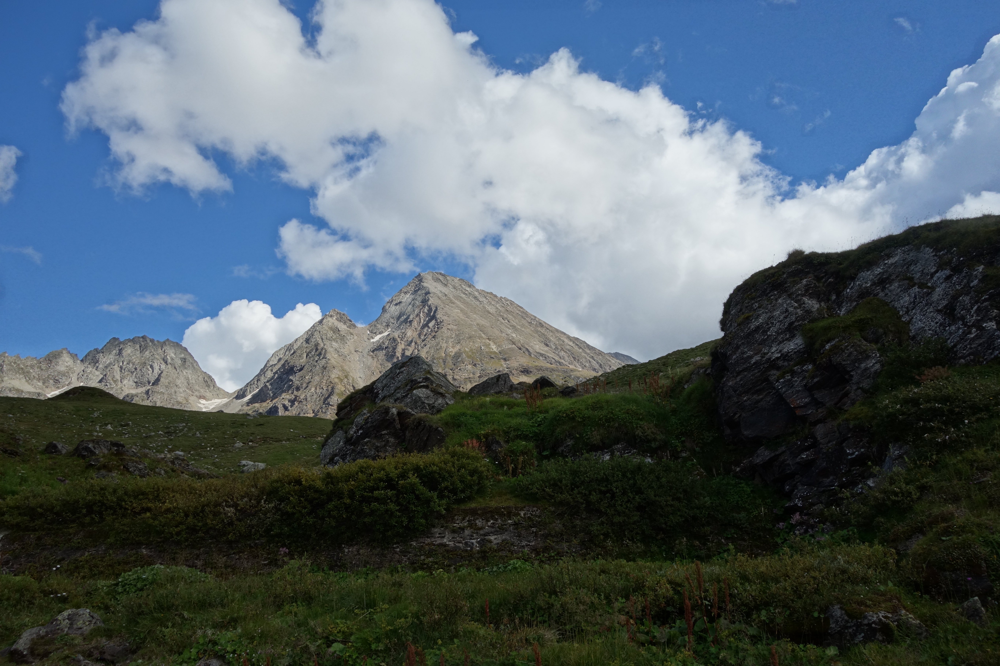  
<em> bijna boven! </em>

En daar is het meer, Lago Toggia!

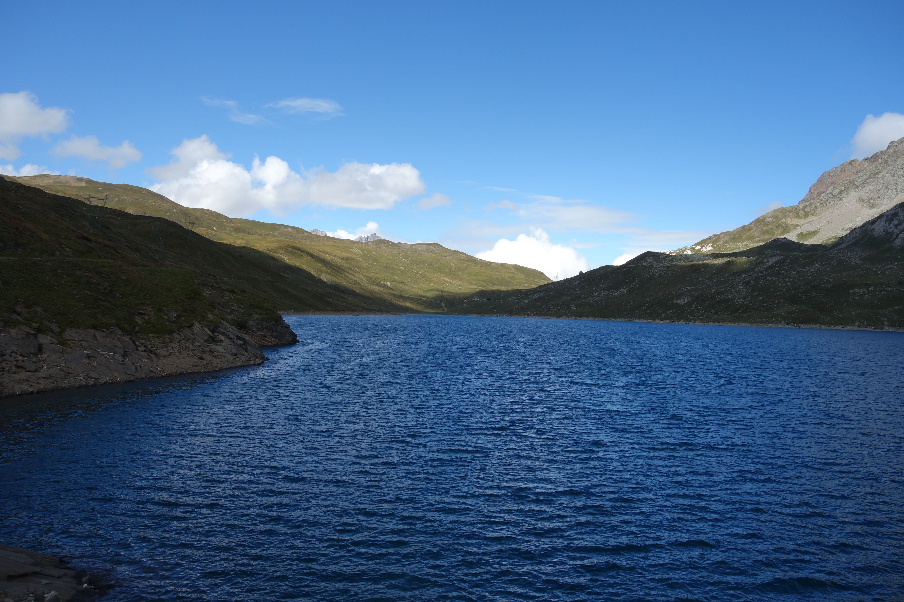  
<em> Lago Toggia </em>

Vlakbij het meer komen we nog langs een refugio, een berghut.

  
<em> berghut </em>

We fantaseren wat over een keer een wandeling doen van berghut naar berghut...
even nog navragen of je lid moet zijn, een Green Pass nodig hebt, of je er kunt eten, hoe je daar slaapt, voor de volgende keer misschien...
met de handjes op de rug lopen we over het officiele pad weer naar beneden, niet zo steil dus, zuutjes aan!

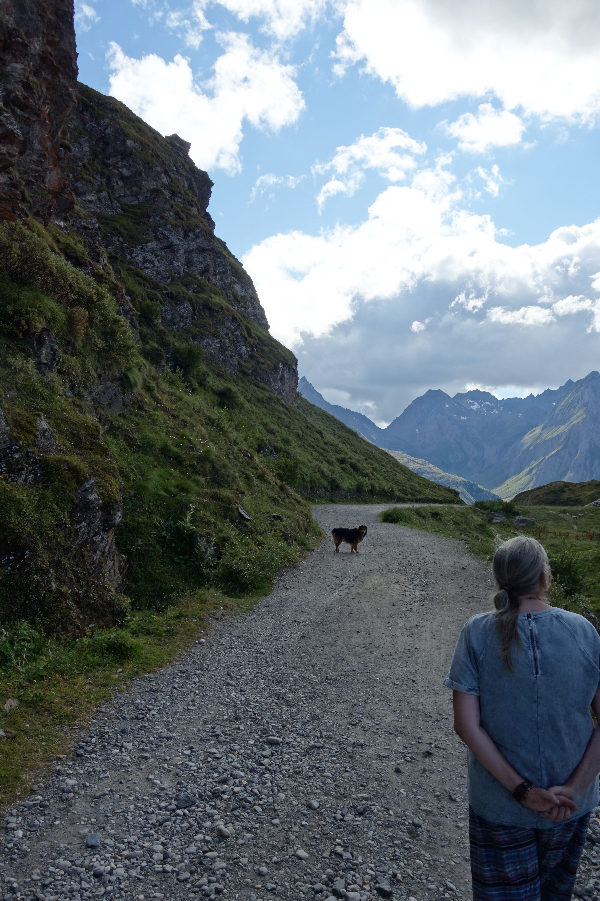 
<em> gompiegompiepom </em>

we zien hoe de wind en de zon lichte plekken maken op het meer van Morasco

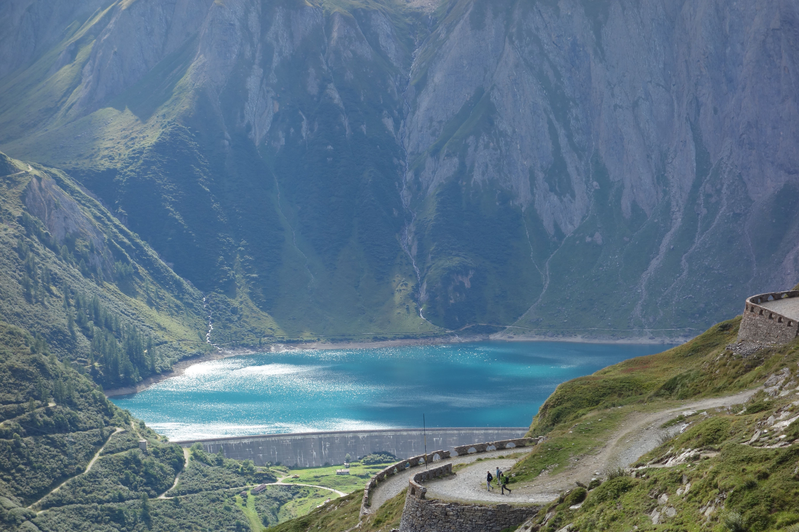  
<em> licht- en windspel op het meer </em>

Deze twee wilden even nog samen op de foto...

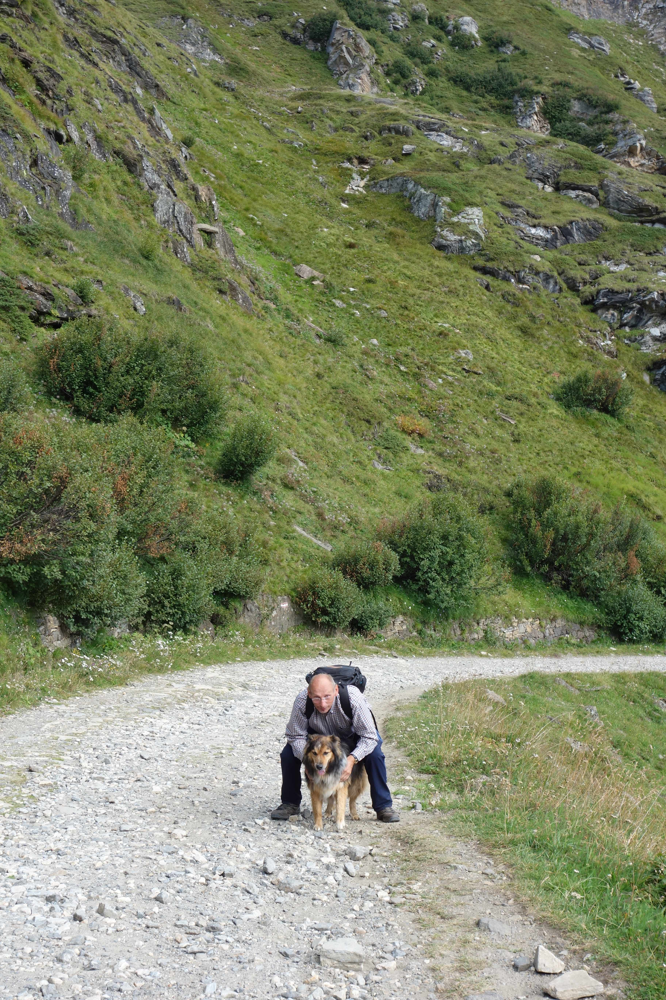  
<em> Peppie en Kokkie </em>

we komen nog vele blauwe gentianen tegen. In het winkeltje bij het hotel zag ik dat ze een gentianenextract verkochten. Of je dat kunt drinken, branden, mee verven???

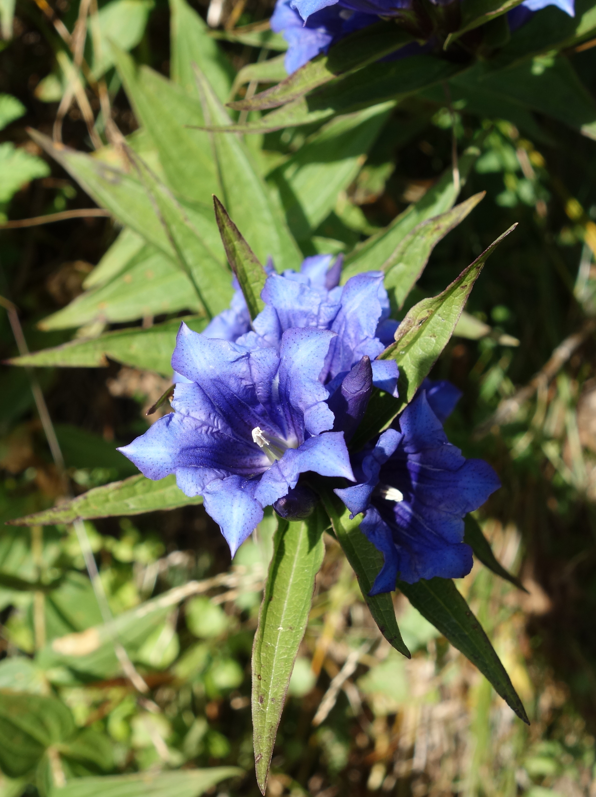 
<em> de gentiaan </em>

Moe maar voldaan komen we bij het hotel en gaan douchen. Daarna is het eindeloos (1 uur)wachten tot we eindelijk mogen gaan eten (19:30 uur)...
