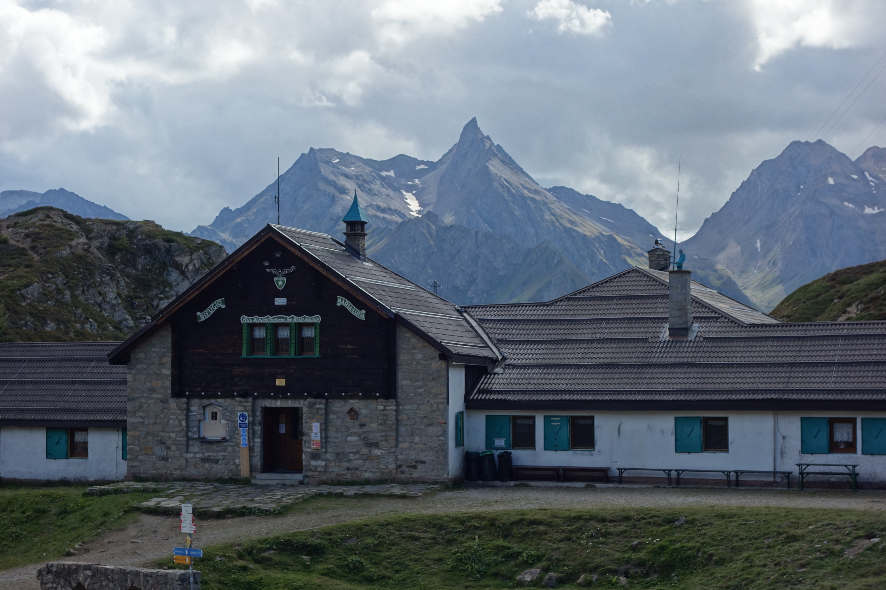
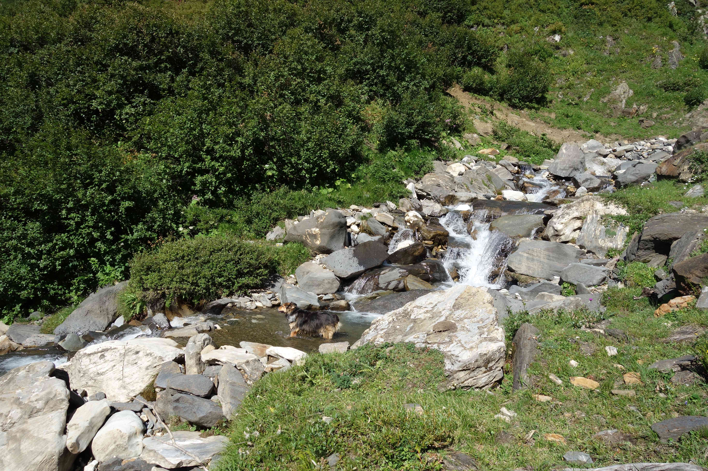
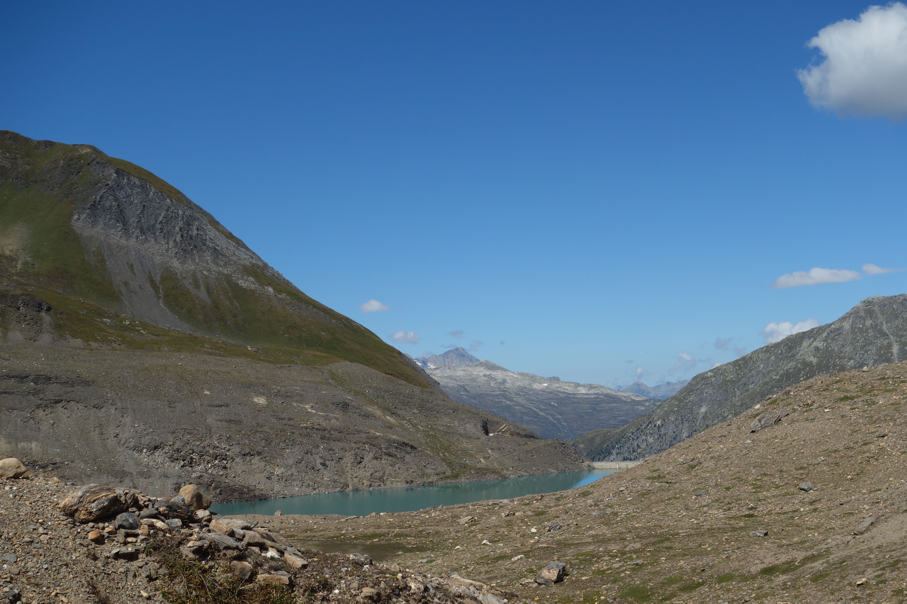

## Riale
#### 31 augustus-3september
Op dinsdag 31 augustus rijden we richting Riale om daar 3 nachten te verblijven in een hotel, Aalts Dorf (op 1700m). Nog in Omegna worden we aangehouden door de cabanieri. Als blijkt dat we Nederlanders zijn hebben ze eigenlijk al spijt...en hoe komen we aan die Italiaanse auto? Gehuurd? De papieren worden gecheckt, ook Kees zijn gloednieuwe Italiaanse rijbewijs. Alles in orde! Eentje loopt nog om de auto en ziet dat Fido los op de achterbank zit. OhOh, dat mag niet. Voor deze keer geen boete (teveel complicaties denk ik), de volgende keer wel is de dreiging. We kopen iets verder op een riem die in de gordelbevestiging kan. We zijn rond 1 uur in de middag bij het hotel, checken in en nemen een lunch. 

  
<em> Aalts Dorf, onze kamer is achterin, bij de rode stoelen. Klaartje rust uit van de grote klim </em>

#### De eerste wandeling, dinsdag 31 augustus
Daarna lopen we de route naar Lago Toggia, de route begint direct bij het hotel. 

  
<em> begin van de route </em>

We kunnen de haarspeldbochten afsnijden en de steile tussendoortjes doen, dit scheelt vele meters volgens ons, is wel zwaarder.

 
<em> binnendoor omhoog </em>

we komen onderweg vele mooie bloemen tegen, onder andere deze "strobloem" die in de zon wel zilver lijkt.

 
<em> strobloemetjes </em>

We beginnen al aardig te klimmen en kijken nu op het Lago Morasco. Het kerkje wordt ook steeds kleiner.

 
<em> uitzicht halverwege </em>

Af en toe volgen we een stukje van de officiele route, totdat we weer binnendoor omhoog kunnen. In de bochten van de echte route staan stenen bogen, waar mensen op kunnen leunen om van het uitzicht te genieten. 

  
<em> uitzicht op ons hotel, op hondshoogte gekeken </em>

Fido kiest voor een ander pad dat parallel met het echte pad loopt, waardoor we langs een mooi vennetje komen

 
<em> vennetje </em>
  
Hier zien we ook de distel (in gedroogde versie)

 
<em> distel </em>

we zijn bijna boven en kijken nu een ander dal in.

 
<em> how green is my valley </em>

We klimmen nog iets en zijn bijna bij het meer.

  
<em> bijna boven! </em>

En daar is het meer, Lago Toggia!

  
<em> Lago Toggia </em>

Vlakbij het meer komen we nog langs een refugio, een berghut.

  
<em> berghut </em>

We fantaseren wat over een keer een wandeling doen van berghut naar berghut...
even nog navragen of je lid moet zijn, een Green Pass nodig hebt, of je er kunt eten, hoe je daar slaapt, voor de volgende keer misschien...
met de handjes op de rug lopen we over het officiele pad weer naar beneden, niet zo steil dus, zuutjes aan!

 
<em> gompiegompiepom </em>

we zien hoe de wind en de zon lichte plekken maken op het meer van Morasco

  
<em> licht- en windspel op het meer </em>

Deze twee wilden even nog samen op de foto...

  
<em> Peppie en Kokkie </em>

we komen nog vele blauwe gentianen tegen. In het winkeltje bij het hotel zag ik dat ze een gentianenextract verkochten. Of je dat kunt drinken, branden, mee verven???

 
<em> de gentiaan </em>

Moe maar voldaan komen we bij het hotel en gaan douchen. Daarna is het eindeloos (1 uur)wachten tot we eindelijk mogen gaan eten (19:30 uur)...

#### Tweede dag, 1 september.
vandaag gaan we de andere kant, langs het meer van Morasco naar boven, naar de Griessee in Zwitserland. Aangezien we het meer van Morasco in juli uitgebreid bekeken en gefotografeerd hebben, slaan we dat over in deze wandeling. Toen waren we met Selwyn en Coline, heel gezellig! (Zie wandelingen juli)
We lopen dus langs het kerkje naar het meer van Morasco, waar Fido plots verdwijnt en in het meer verschijnt! Heel slim want de rest van het pad langs het meer is veel te steil naar het meer toe, dus dit was de enige kans!

  
<em> de Seemeermin </em>

Aan het einde van het meer zou de route naar boven gaan, we volgen de bordjes maar komen op een waterval uit. Fido grijpt zijn kansen!

  
<em> Ons nijlpaard </em>

Omdat het pad hier ophoudt zit er niets anders op dan de waterval over te steken en eenmaal aan de overkant komen we toch op het goede pad uit.
Achterom kijkend hebben we een mooi uitzicht op het meer van Morasco.

 
<em> het meer van Morasco </em>

Het pad voert ons hoger en hoger...

 
<em> af en toe even stoppen om van het uitzicht te genieten (en uit te hijgen) </em>

En om ons flesje water weer te vullen met lekker koel water. Volgers kenners kan dit gevaarlijk zijn, maar we zijn er nog nooit ziek van geworden!

 
<em> koel helder water </em>

Na deze hoogte overwonnen te hebben komen we op een kale vlakte uit. Fido neemt uiteraard weer een "duik". 

  
<em> weer ons nijlpaard </em>

Lekker modderig komt hij er weer uit. We gaan even zitten om iets te eten. Aan de bordjes zien we dat we nog veel verder omhoog moeten om bij de Griessee te komen...

  
<em> terugblik </em>

we zien hier nog stukjes ijs/sneeuw

 
<em> zullen we Fido met sneeuwballen bekogelen? </em>

we beginnen met de bestijging, alhoewel de eerste beklimming nog flink in mijn benen zit.

 
<em> dit is het pad omhoog </em>

Halverwege geef ik het op, Kees gaat alleen, Fido blijft mij gezelschap houden. Kees moet nog een half uurtje omhoog (in mijn tempo zou het een uur zijn).
Hierboven treft hij een maanlandschap aan...

  
<em> met in de verte de Griessee </em>

Kees is nu op 2450m hoogte en dat is ook wel te zien!

  
<em> hoog in de bergen </em>

Kees loopt nog door tot de Griessee

  
<em> De Griessee, in Zwitserland </em>

Tot zijn verbazing duiken ook hier windmolens op. Er is geen zuchtje wind...

  
<em> zelfs hier nog windmolens </em>

Kees keert weer terug. Ik heb een dutje gedaan terwijl Fido op mij pastte.

 
<em> Grote oppas Chewbacca </em>

We dalen weer langzaam en voorzichtig af tot we weer op de kale vlakte komen. Daar nemen we niet de steile afdaling maar nemen het "oudelullenpad" zoals we het genoemd hebben. Het is een pad dat beneden afgesloten was met een bord "privato" maar we zien meerdere mensen dit nemen dus gaan we ervan uit dat het goed komt!
Al spoedig hebben we weer uitzicht op het meer van Morasco.

  
<em> we zien hier ook het pad dat we met Selwyn en Coline genomen hebben aan de andere kant van het meer </em>

We komen nog langs een grote waterval waar het krioelt van de vlinders, helaas niet op de foto te pakken.

 
<em> De vlinderwaterval </em>

al slingerend met haarspeldbochten komen we weer in het dal

 
<em> Fido wijst de weg </em>

Tegen half 5 zijn we weer in Riale. We nemen nog een biertje en een colaatje op het terras waar we langskomen en gaan dan terug naar het hotel, douchen en wachten...op het late eten! De porties waren de vorige avond zo groot dat ik vanmorgen in het Italiaans op de keuzemenukaart geschreven heb dat halve porties genoeg zijn. Ze moesten erom lachen.Maar...we kregen halve porties en het was inderdaad genoeg!

#### Derde dag, 2 september

We willen vandaag naar Lago Castel. Dat kan via hetzelfde pad van de eerste dag, naar Lago Toggia, maar dat willen we niet. Op de kaart is een andere route te zien naar Lago Castel, eerst richting de Cascate del Toce. Dus lopen we vanuit het hotel over het pad naar Cascate del Toce.Het is rond 10 uur en de nevel hangt nog in het dal. 

  
<em> nevelachtig </em>

We zien in de nevel een waterval, waar we later heel dichtbij komen (blijkt achteraf)

 
<em> waterval </em>

Het pad van het hotel naar de Cascate del Toce gaat over een heuvel heen, omhoog. 

 
<em> pad omhoog </em>

Op de grote parkeerplaats aangekomen bij de Cascate del Toce kijken we even bij het souvenirwinkeltje en terwijl we staan te kijken naar de wandelstokken komt de eigenares naar buiten. Ze demonstreert de flexibele carbon telescoopstokken en we kopen deze, misschien met een vooruitziende blik...
we lopen even het uitzichtsbruggetje op van de Cascate del Toce en maken daar een foto.

 
<em> de Cascate del Toce van bovenaf </em>

we kijken op de kaart en de navigatie. Volgens de kaart zouden we een stuk over de weg moeten, maar die gaat zo de tunnel in, dat zien we niet zitten. Bovendien zouden we dan 650 meter recht omhoog moeten. Volgens de navigatie moeten we een stuk terug en is daar een pad naar Lago Castel. Dit hebben we blijkbaar gemist. We lopen terug en ..inderdaad statt daar een bord richting Lago Castel. 
We nemen dit pad en het blijkt algauw de hele steile klim te zijn! De stokken worden op mijn hoogte gezet en met de twee stokken kom ik langzaam omhoog. Ik durf nog niet echt met mijn volle gewicht op mijn rechterkant te steunen, het is maar twee maanden geleden dat mijn elleboog uit de kom en gebroken was, maar het helpt wel, de twee stokken. Toch vrij snel zitten we al weer hoog (na om de zoveel meter uitpuffen, uiteraard)

 
<em> het kerkje is nu wel piepklein! </em>

Vanuit dit vergezicht zien we de weiden waar we met Selwyn en Coline geweest zijn, we zijn daar al ver boven!

  
<em> met daarachter het meer Morasco </em>

Het pad wordt maar steiler en steiler (dit pad gaan we echt niet terug), eindelijk boven komen we op een breed pad.

  
<em> Fidootje voorop </em>

Dit vonden we een grappig bloemetje

  
<em> warbolletje </em>

En ze zijn met velen!

  
<em> allemaal in de war </em>

Het wordt mooi, zo met de wolken in de bergen

  
<em> in de wolken </em>

Uiteindelijk komen we bij het Lago Castel. 

  
<em> Lago Castel </em>

Er komen steeds meer grijze wolken, wel mooi, maar blijft het droog?

 
<em> grijze lucht.. </em>

Indrukwekkend is ook dat er helemaal niemand te zien is, we zijn alleen op de wereld!

  
<em> Lago Castel </em>

we zien een grote afgrond...

  
<em> wel mooi! </em>

we gaan langs het meer en aan de andere langzaam weer naar beneden, over een breed pad

  
<em> Fietje weet de weg </em>

met de stokken...

  
<em> Toch wel heel anders dan de heenweg! </em>

Rond half 6 zijn we weer bij het hotel, terrasje pikken, douchen en eten! Ons laatste avondmaal (halve porties).

De volgende dag, 4 september rijden we na het ontbijt terug naar huis, na eerst nog wat kaas gekocht te hebben in het winkeltje bij het hotel.
Een fijne korte vakantie!
