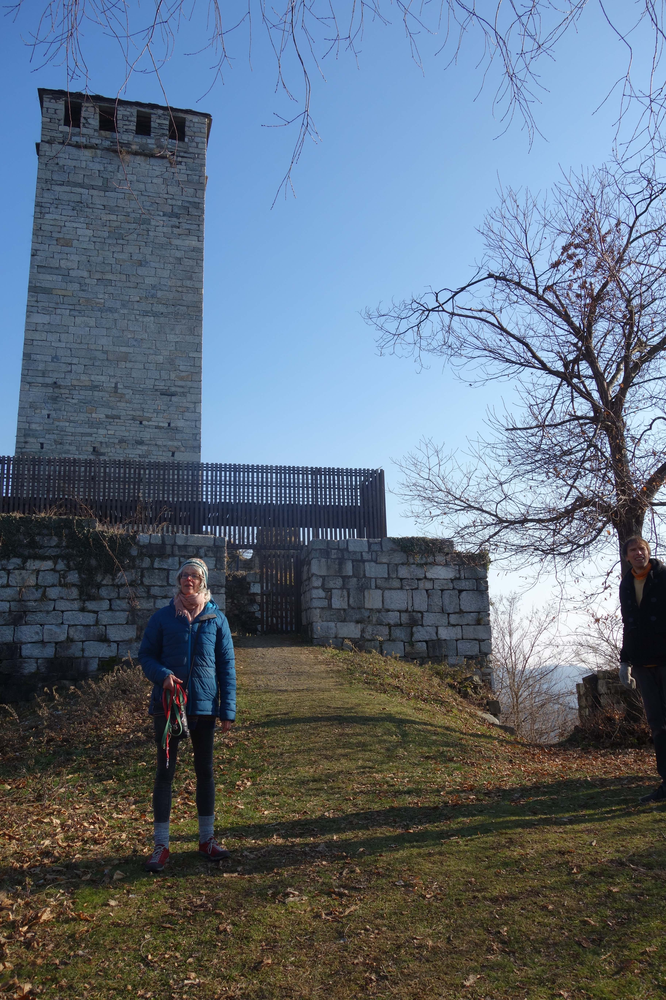
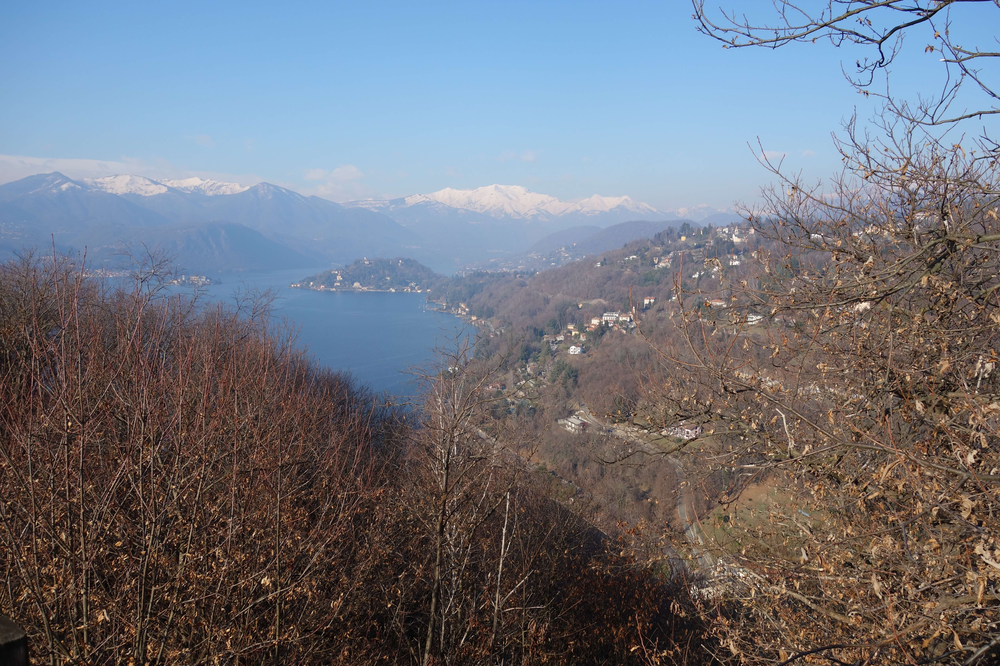
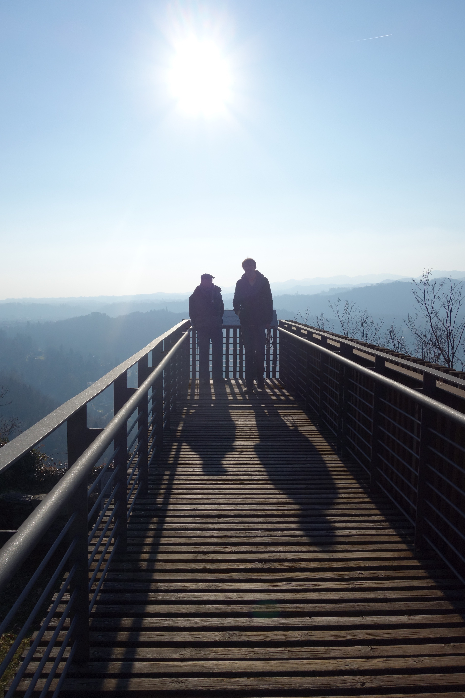
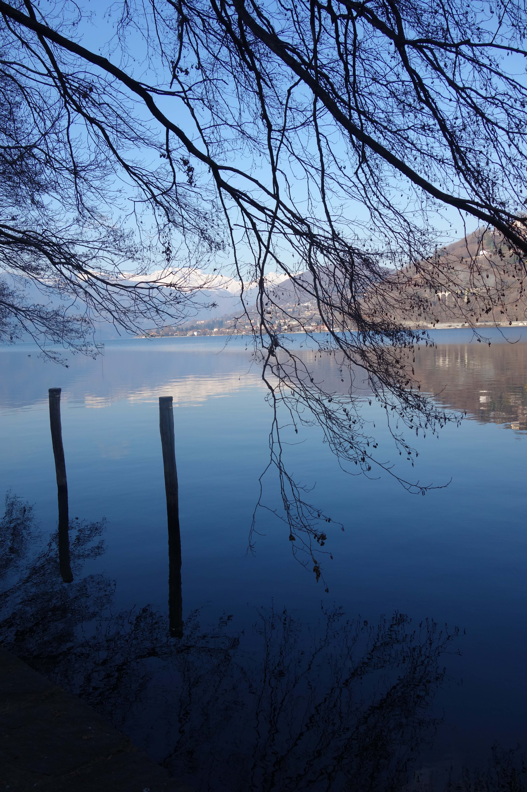
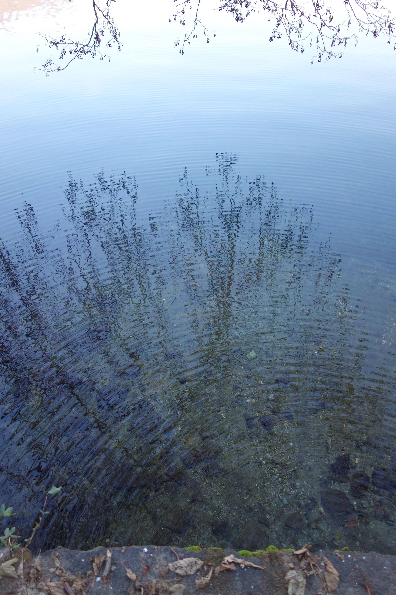

## Torre di Buccione en Orta S. Giulio
op zondag 17 januari rijden we met twee auto's en alle bewoners van Casa Rosa naar de Torre di Buccione, een restant van een 12e eeuws kasteel op een heuvel bij het zuiden van het Ortameer. Na een korte klim staan we bij de toren.  

 
<em> Erika bij de toren </em>

De toren zelf is afgesloten, wel is er een uitzichtsplateau gemaakt. Fido durft niet naar boven, het is een open ijzeren trap...

 
<em> uitzicht op Orta S. Giulio </em>

 
<em> Kees en Thomas op het uitzichtsplateau </em>

Weer beneden rijden we naar Orta S. Giulio en lopen het pad langs het meer. 

 
<em> langs het Ortameer </em>

deze foto heb ik gemaakt omdat ik het mooi vond hoe een paar druppels zoveel beweging veroorzaakten...

 
<em> kringen in het water </em>

