## 22 november Tre Alberi
Na drie weken hard werken aan het huis trekken we er op zondag 22 november erop uit: naar Tre Alberi, een punt waar vroeger drie grote beuken gestaan zouden hebben, nu blijkt er nog maar één te staan..
We lopen de steile helling op naar Alpe Selviana, waar onze hout"boer" woont, Diego. 

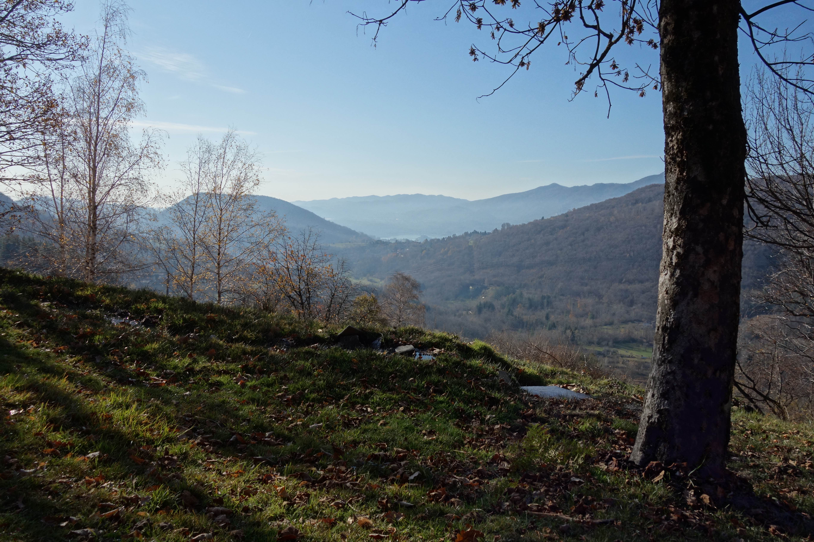 
<em> uitzicht vanuit Alpe Selviana </em>

Ondanks dat het koud is is het op de zonnekant van de heuvel wel lekker.

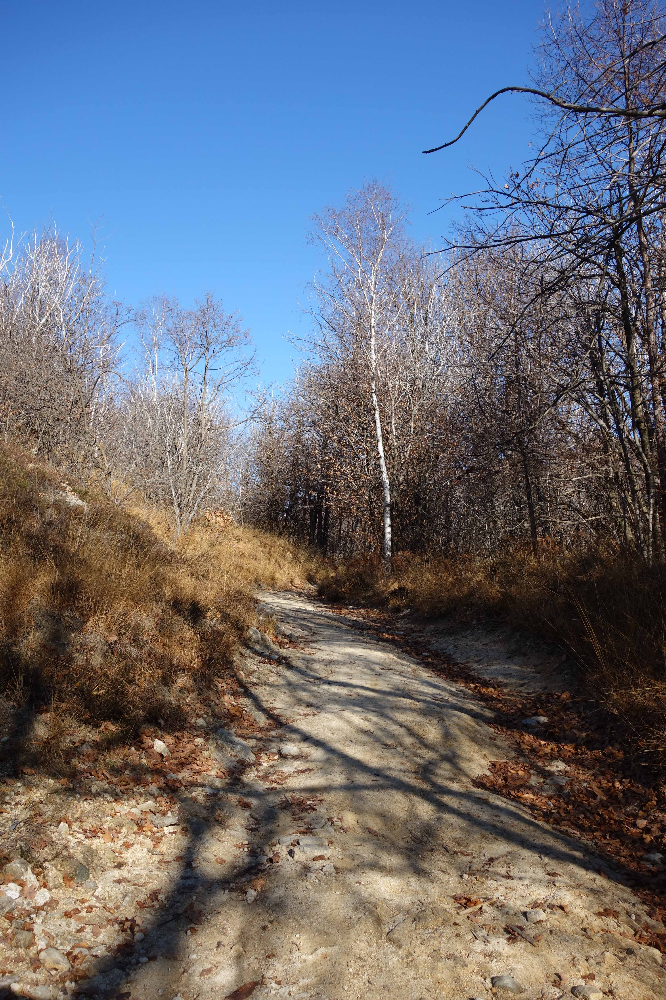 
<em> Tussen de berken </em>

na een klim van ongeveer een drie kwartier komen we bij het bord

we zouden kunnen doorlopen, maar het is koud en we gaan terug, eerst maken we nog een foto van het uitzicht op Omegna, door de bomen heen.

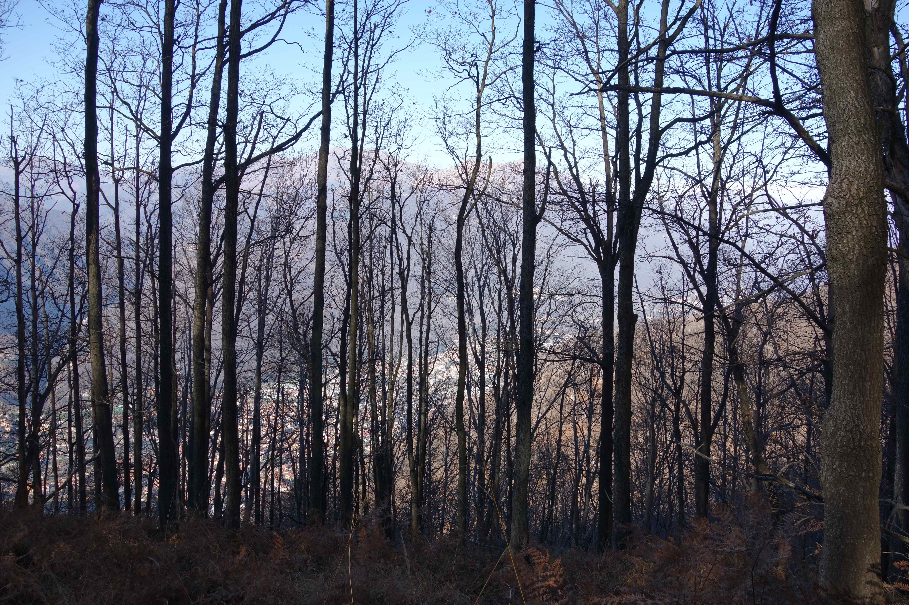 
<em> Omegna in de verte </em>
 
Op de terugweg nog een uitzicht op het Ortameer met het eilandje

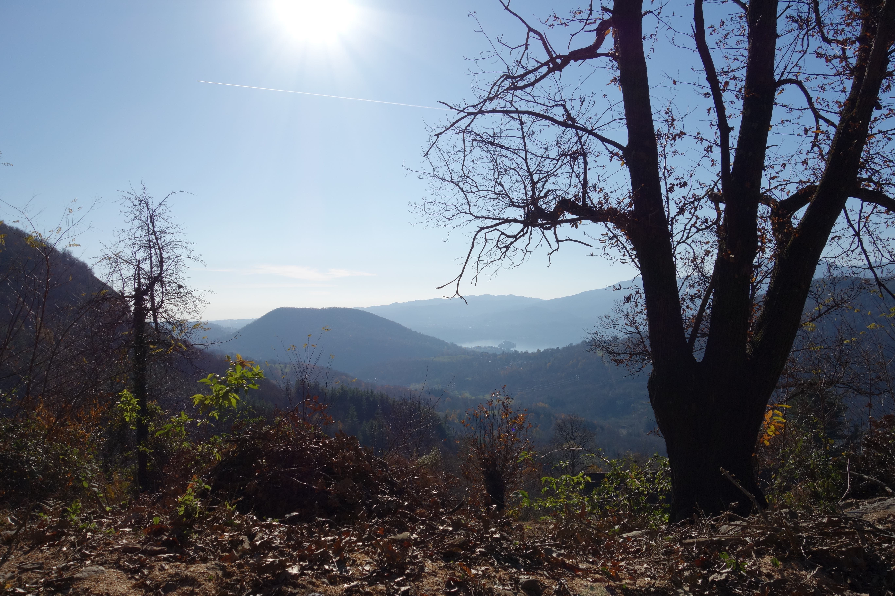 
<em> het Ortameer </em>

Bij de bron van Agrano vullen we onze waterflessen, lekker en gezond water!
Normaal nemen we het water bij de bron in het dorp, is ook goed, maar dit water schijnt beter te zijn.

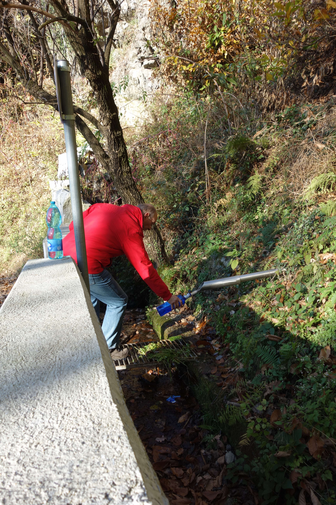 
<em> Flesjes vullen </em>

## Eerste ontmoeting met Fido, 13 december
Erika heeft ons warm gemaakt om te gaan kijken voor een hond in "haar" Canile (hondenopvang), waar ze vrijwilligerswerk verricht.
Aan de hand van de foto's op internet maken we een keuze: Fido of Rex. Fido is een kruising waar een Australische herder in zit, 7 jaar oud, en Rex is een 3 jaar oude Duitse herder. Fido heeft een "duister" verleden, hij zou een vrouw hard in haar kuiten gebeten hebben, waarom hij gebeten heeft weten ze niet. Hij zit al 3 jaar in de opvang en er is nog nooit iemand naar hem komen kijken. Meteen vallen zijn lieve ogen op, in één van zijn ogen loopt een litteken. Hij heeft een mooi kopje dat niet bij het massieve, brede lijf lijkt te passen. Hij legt meteen zijn brede poot op Marion, en er is een klik! We mogen met hem gaan wandelen.

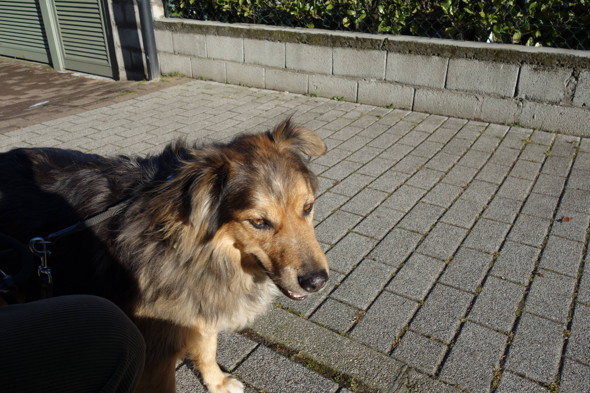 
<em> hier zie je goed zijn litteken </em>

Van achter gezien moet Marion er erg om lachen en ze vergelijkt Fido met een mammoet...

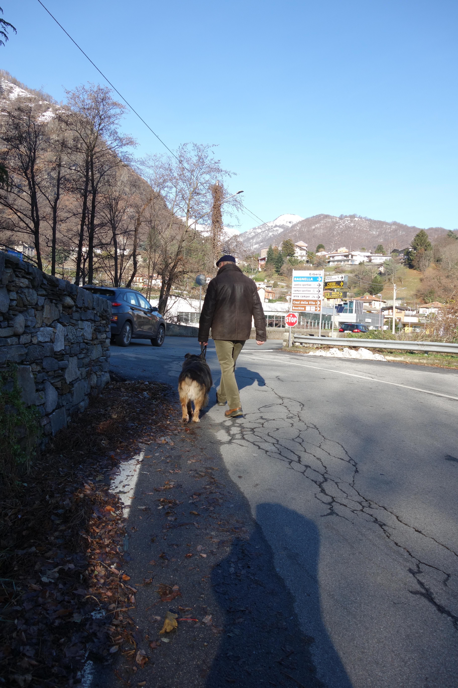 
<em> Fido's achterste </em>

We besluiten deze hond te willen, maar de adoptie-procedures moeten gevolgd worden...Eerst nog een paar keer met hem wandelen (en kijken hoe het met de drie honden van Erika samen gaat), dan nog een bezoek thuis van iemand van de hondenopvang of de woonomgeving wel geschikt is...uiteindelijk komt Fido "op proef" op 17 december. 

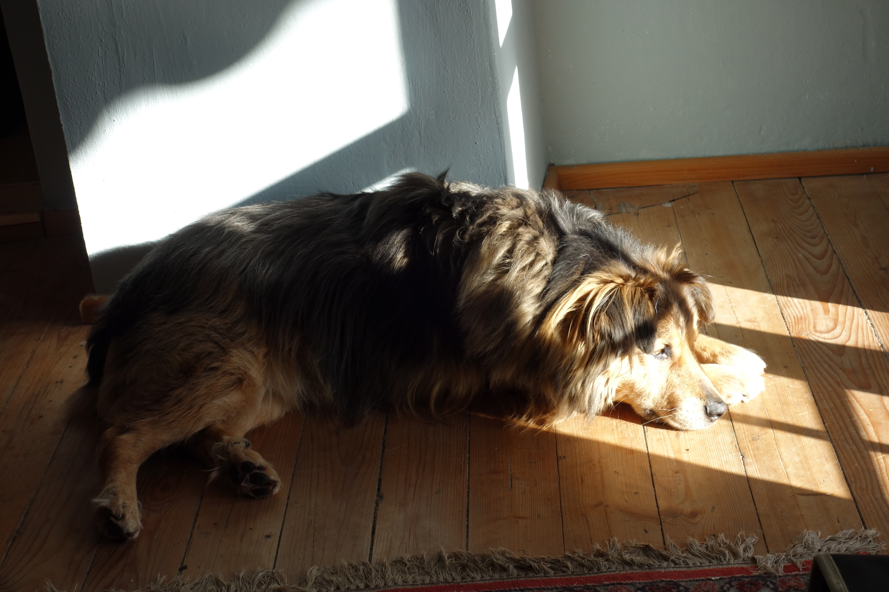 
<em> daar ligt ie dan </em>

## "Test"Wandeling met Fido en de rest, 18 december
We gaan met zijn allen wandelen: Romina, Thomas en Erika en hun drie honden, wij met Fido.

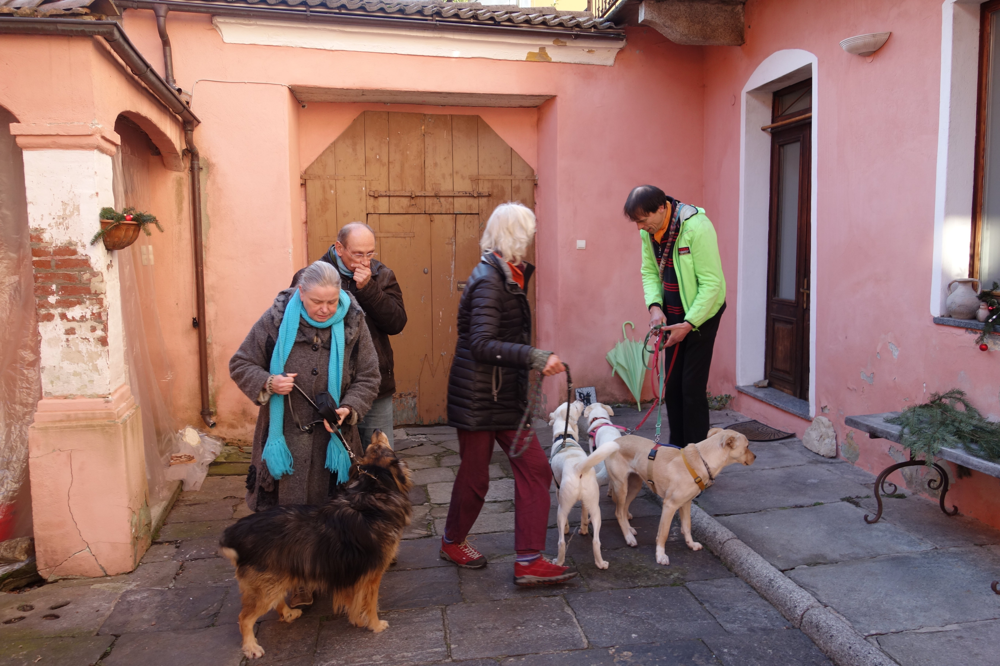 
<em> voordat we allemaal onze jas/riem aan hebben </em>

We lopen de berg op, naar Alpe Selviana en genieten van het uitzicht.

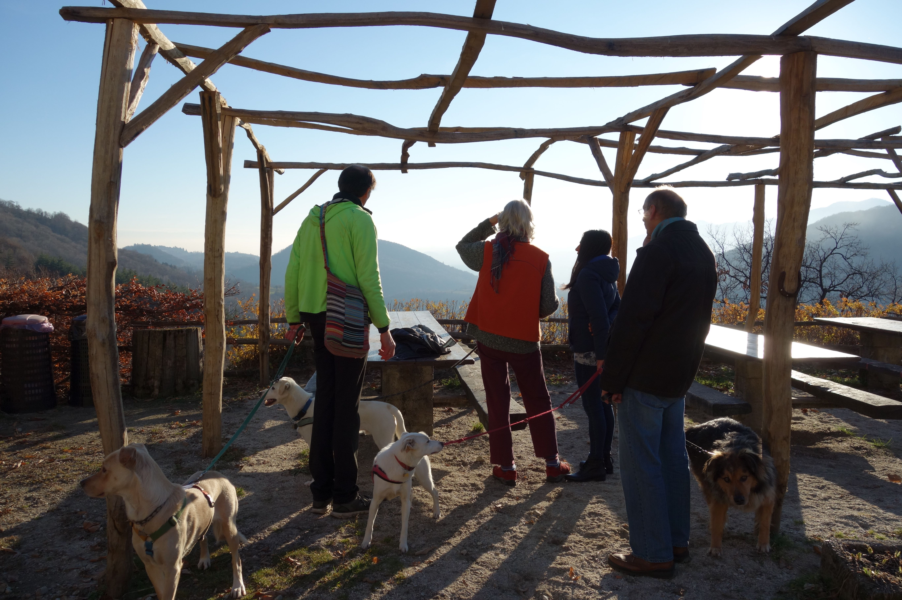 
<em> Terwijl er van het uitzicht genoten wordt, doet Fido zijn ding </em>

Er wordt een groepsfoto gemaakt van de bewoners van Casa Rosa

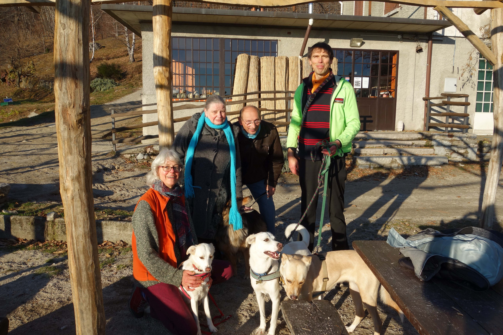 
<em> allemaal op de foto </em>

We lopen nog tot de waterval, maar omdat we die al zo vaak op de foto hebben maakt Marion een andere foto

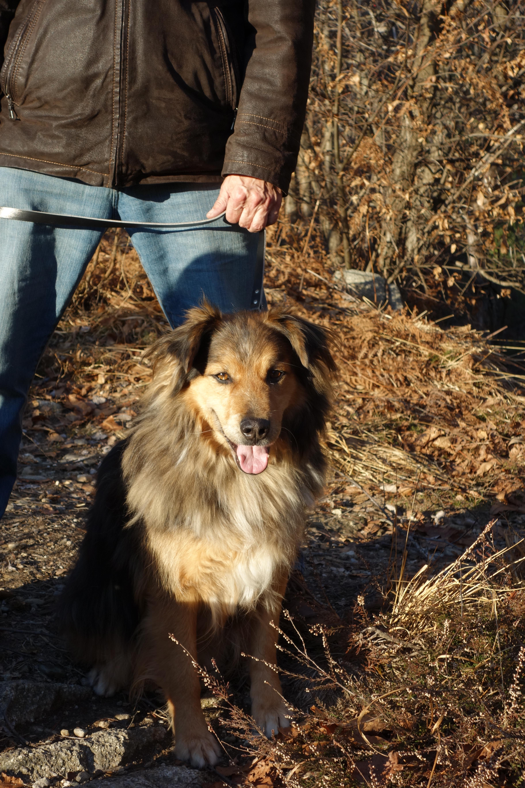 
<em> wat een knapperd!(die hond) </em>

En op de terugweg nog even een foto van de besneeuwde top

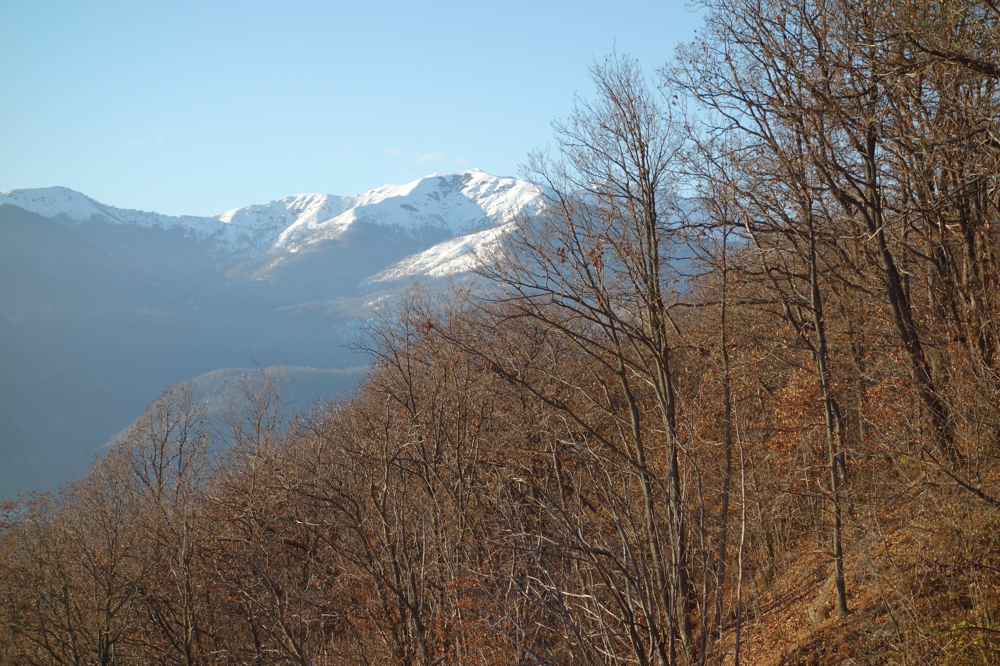 
<em> mooie kleuren </em>

