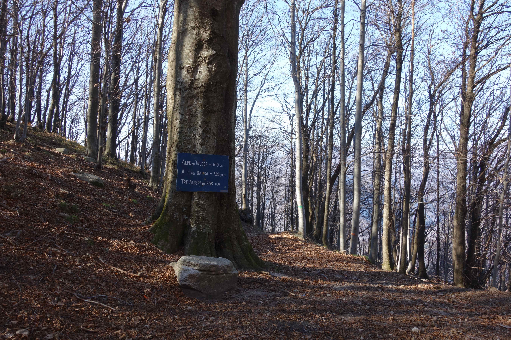

Na drie weken hard werken aan het huis trekken we er op zondag 22 november erop uit: naar Tre Alberi, een punt waar vroeger drie grote beuken gestaan zouden hebben, nu blijkt er nog maar één te staan..
We lopen de steile helling op naar Alpe Selvina, waar onze hout"boer" woont, Diego. 

 
<em> uitzicht vanuit Alpe Selvina </em>

Ondanks dat het koud is is het op de zonnekant van de heuvel wel lekker.

 
<em> Tussen de berken </em>

na een klim van ongeveer een drie kwartier komen we bij het bord

 
<em> we kunnen nog hoger... </em>

we zouden kunnen doorlopen, maar het is koud en we gaan terug, eerst maken we nog een foto van het uitzicht op Omegna, door de bomen heen.

 
<em> Omegna in de verte </em>
 
Op de terugweg nog een uitzicht op het Ortameer met het eilandje

 
<em> het Ortameer </em>

Bij de bron van Agrano vullen we onze waterflessen, lekker en gezond water!
Normaal nemen we het water bij de bron in het dorp, is ook goed, maar dit water schijnt beter te zijn.

 
<em> Flesjes vullen </em>

