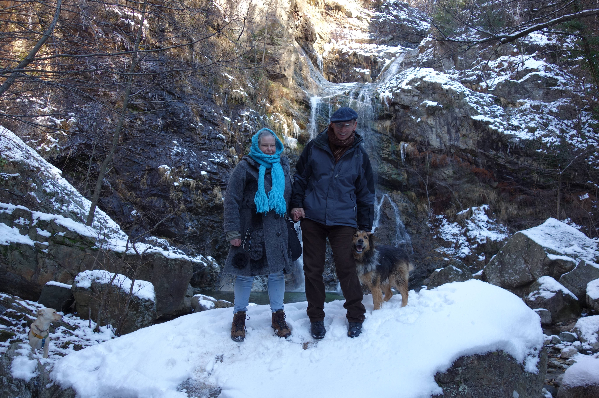

## 22 november Tre Alberi
Na drie weken hard werken aan het huis trekken we er op zondag 22 november erop uit: naar Tre Alberi, een punt waar vroeger drie grote beuken gestaan zouden hebben, nu blijkt er nog maar één te staan..
We lopen de steile helling op naar Alpe Selviana, waar onze hout"boer" woont, Diego. We passeren daarbij de natuurlijke bron van Agrano. 

 
<em> uitzicht vanuit Alpe Selviana </em>

Ondanks dat het koud is is het op de zonnekant van de heuvel wel lekker.

 
<em> Tussen de berken </em>

na een klim daarna van ongeveer drie kwartier komen we bij het bord

we zouden kunnen doorlopen, maar het is koud en we gaan terug, eerst maken we nog een foto van het uitzicht op Omegna, door de bomen heen.

 
<em> Omegna in de verte </em>
 
Op de terugweg nog een uitzicht op het Ortameer met het eilandje

 
<em> het Ortameer </em>

Bij de bron van Agrano vullen we onze waterflessen, lekker en gezond water!
Normaal nemen we het water bij de bron in het dorp, is ook goed, maar dit water schijnt beter te zijn.

 
<em> Flesjes vullen </em>

## Eerste ontmoeting met Fido, 13 december
Erika heeft ons warm gemaakt om te gaan kijken voor een hond in "haar" Canile (hondenopvang), waar ze vrijwilligerswerk verricht.
Aan de hand van de foto's op internet maken we een keuze: Fido of Rex. Fido is een kruising waar een Australische herder in zit, 7 jaar oud, en Rex is een 3 jaar oude Duitse herder. Fido heeft een "duister" verleden, hij zou een vrouw hard in haar kuiten gebeten hebben, waarom hij gebeten heeft weten ze niet. Hij zit al 3 jaar in de opvang en er is nog nooit iemand naar hem komen kijken. Meteen vallen zijn lieve ogen op, in één van zijn ogen loopt een litteken. Hij heeft een mooi kopje dat niet bij het massieve, brede lijf lijkt te passen. Hij legt meteen zijn brede poot op Marion, en er is een klik! We mogen met hem gaan wandelen.

 
<em> hier zie je goed zijn litteken </em>

Van achter gezien moet Marion er erg om lachen en ze vergelijkt Fido met een mammoet...

 
<em> Fido's achterste </em>

We besluiten deze hond te nemen, maar de adoptie-procedures moeten gevolgd worden...Eerst nog een paar keer met hem wandelen (en kijken hoe het met de drie honden van Erika samen gaat), dan nog een bezoek bij ons thuis van iemand van de hondenopvang of de woonomgeving wel geschikt is...uiteindelijk komt Fido "op proef" op 17 december. Tot onze verbazing staat Fido ook op de kalender die uitgegeven wordt door de hondenopvang en trots kopen we deze. We hebben een "calendarboy" 

 
<em> daar ligt ie dan </em>

## "Test"wandeling met Fido en de rest, 18 december
We gaan met zijn allen wandelen: Romina, Thomas en Erika en hun drie honden, wij met Fido.

 
<em> voordat we allemaal onze jas/riem aan hebben </em>

We lopen de berg op, naar Alpe Selviana en genieten van het uitzicht.

 
<em> Terwijl er van het uitzicht genoten wordt, doet Fido zijn ding </em>

Er wordt een groepsfoto gemaakt van de bewoners van Casa Rosa

 
<em> allemaal op de foto </em>

We lopen nog tot de waterval, maar omdat we die al zo vaak op de foto hebben maakt Marion een andere foto

 
<em> wat een knapperd!(die hond) </em>

En op de terugweg nog even een foto van de besneeuwde top

 
<em> mooie kleuren </em>

## wat steden in de buurt
# Omegna
Uiteraard komt dan eerst Omegna, zo'n 5 km van ons vandaan, waar we de meeste boodschappen doen en op donderdag naar de markt gaan

 
<em> Erika met Kyra in Omegna </em>

Omegna is een stad met meer dan 15 duizend inwoners aan het noordelijkste uiteinde van het Ortameer, een meer van glaciale oorsprong. Het Ortameer wordt beschouwd als het kleinste maar meest typische meer van Noord-Italië. Omgeven door bergen, weerspiegelt het water van het meer de grenzen van Omegna. Vervolgens stroomt het water in de rivier Nigoglia, die zich later weer bij de beek Strona voegt, en uiteindelijk het Lago Magiore bereikt.Omegna heeft een groot industrieel verleden: de achttiende-eeuwse industriële vestiging Ferriera (IJzerfabriek) en Fabbricone Angeli-Frua (Angeli-Frua Manufacturing), een textielbedrijf dat in 1896 werd opgericht, getuigen hiervan. Bekende merken uit het oude Omegna zijn Alessi, Calderoni, Girmi, Lagostina, La Nuova Faro, Irmel, Tracanzan en Piazza. Eigenlijk is Omegna een beetje als Oss: terwijl eerst iedereen zijn brood verdiende in de metaal- en textielindustrie is deze weggetrokken uit de stad en zie je overal de restanten van leegstaande fabrieken. 
Op tweede kerstdag is er een demonstratie in Omegna, met sprekers en muziek.

 
<em> Ook Thomas neemt het woord </em>

Agrano is zoal Berghem bij Oss, het hoort tot de gemeente Agrano maar is eigenlijk een apart dorp. De hoofdattractie van het dorp is de "mummy", de dode van Agrano. In 1792 werd er tussen de beenderen van het kerkhof van Agrano een vrijwel intact lichaam gevonden van een vrouw. Na intense studie blijft het een mysterie, ze is ook niet geidentificeerd. Ze heeft lang in een glazen kist gelegen in de kapel, maar in de loop der jaren verviel het lichaam meer en meer en met hulp van giften uit Agrano is besloten tot een restauratie en ligt ze nu in een hermetisch afgesloten kist. 

 
<em> de dode van Agrano </em>

## Sneeuw in Agrano
Helaas net na de kerst, op 28 december, is Agrano bedekt met een flinke pak sneeuw. 

 
<em> Het straatje waar we met Fido lopen om bij het vrije pad te komen </em>

 
<em> Idyllisch plaatje van de rotonde van Agrano </em>

We hebben ondertussen de papieren getekend voor de officiele adoptie van Fido, waarbij Fido zich achter mij verstopt als de man van de hondenpvang binnen komt. 
Duidelijk is dat ie niet meer terug wil! De man vraagt of wij een foto willen maken van ons en Fido om deze met enige dankwoorden op Facebook te kunnen zetten.
We besluiten naar de waterval te lopen om daar een mooie foto te maken.  
Na vele pogingen (waarbij Fido ons bijna van de rots af duwt) wordt het deze foto:

 
<em> de foto voor de hondenopvang </em>

Terwijl iedereen druk bezig is, blijft Fido in volle meditatie naar de waterval kijken, minutenlang!

 
<em> Fido in trance </em>

Het is de eerste keer dat we Fido los laten, da's wel spannend. We moeten best wel klimmen en Fido staat boven op ons te wachten. We proberen of ie terugkomt,
door te roepen maar je ziet hem denken: jullie moeten hier toch ook omhoog. Hij blijft geduldig wachten en uiteindelijk voegen ons bij de "leider".

 
<em> Je bent de baas of je bent het niet, komen jullie nog? </em>

Uiteindelijk maken we nog een foto van ons met Fido om uit te kiezen voor de hondenopvang. Je ziet nu wel aan onze gezichten dat het koud is, deze foto wordt het niet!

 
<em> kouw kupkes </em>

Wanneer de sneeuw weer weg is, blijft het toch koud (of komt dat gevoel het door het feit dat we nog geen goede kachel hebben...). Fido is nu helemal gewend en we gaan veel met hem wandelen.

 
<em> mooie besneeuwde toppen in de verte </em>

Dat het nog vriest is te zien onderweg naar Pratolungo

 
<em> bevroren takjes bij een watervalletje </em>
 
<em> wijze blik... </em>
  

## Richting Pratulango
De wandeling naar Pratolungo is de wandeling die we het vaakst lopen. We kunnen gewoon van huis uit weg lopen, lopen langs het voetbalveld en het veldje van Massino (onze koelkastleverancier en over-overbuurman) het bos in. We moeten een klein watervalletje oversteken, waar Fido altijd even een bad neemt. 

 
<em> de schone bader </em>
 
<em> het zonlicht op het watervalletje </em>

wanneer we na het kleine watervalletje linksaf gaan , het dal in, (dus niet naar Pratolungo) kunnen we nog naar de grote waterval.

 
<em> het dal </em>
 
 en ook deze bloemetjes vind ik mooi (begin maart)
 
 
<em> paarse bloemetjes </em>
 op het bruggetje </em>

we lopen door het dal naar het bruggetje, waar ik een foto maak van het stroompje.
 
 
<em> op het bruggetje </em>

Na het bruggetje komen we een kudde geiten tegen die met veel gebel rondtrekken

 
<em> belgeiten </em>
 
<em> huizen hier in de omgeving </em>
 
<em> een favoriet plekje uit de buurt </em>
 
Ook Fido geniet nog even van de waterval.

 
<em> een favoriet plekje uit de buurt </em>

Fido gaat nog even hier in bad en dan zijn we in 10 minuten weer thuis!

## richting Crabbia en Monte Barro
Er loopt een mooi bospad van Agrano naar Crabbia, Kees gebruikt dit pad ook om hard te lopen.
Behalve de kleine witte bloemetjes vinden we ook dit veel langs het pad:
 
 
<em> ik weet even de naam niet </em></p

 

