## Quarna Sopra, 30 maart
We rijden naar Cireggio, een dorpje dat net als Agrano tot Omegna behoort, en parkeren de auto vlakbij het kerkje. We pakken het pad sentiero Beltrami. Dit pad is genoemd naar Capitano Beltrami, een beroemd verzetsfiguur uit de tweede oorlog. Hij is geboren in Cireggio, verhuisd naar Milaan en later, toen hij bevorderd was tot kapitein van de 27e Baggio Artillerie van het Koninklijk Leger in 1943,  weer teruggekeerd naar Cireggio. De architect, die in de streek bekend stond om zijn anti-fascistische ideeën, werd al spoedig benaderd door enkele jonge communisten en slaagde er al snel in het bevel te voeren over een groep soldaten die aan de Duitsers waren ontsnapt en een partizanenformatie vormden in de omgeving van Quarna, in de Strona-vallei; in december telde de groep reeds ongeveer 200 partizanen. Na de gevechten eind januari 1944 was de groep erg moe. Op aandringen van de nazi-fascisten verlieten Beltrami en een deel van zijn groep de Strona-vallei en stelden zich op rond Megolo (een gehucht van Pieve Vergonte), in de Ossola. In een gesprek met een officier van het Duitse commando in Meina, wees Beltrami het aanbod van een vrijgeleide af in ruil voor het opgeven van de strijd. Op 13 februari viel de vijand aan en de partizanen bezweken uiteindelijk aan de aantallen van hun tegenstanders, nadat al hun munitie was uitgeput. Samen met Beltrami sterven 12 andere partizanen.Waarschijnlijk wachtte hij tevergeefs op versterkingen van andere partizanenformaties in het gebied. In het dorpje Cireggio staat een standbeeld van hem. Dit pad naar Quarna werd waarschijnlijk door zijn groep gebruikt.
Het pad is een enorme klim, we (Marion) hebben meerdere tussenstops nodig om bij te komen. 

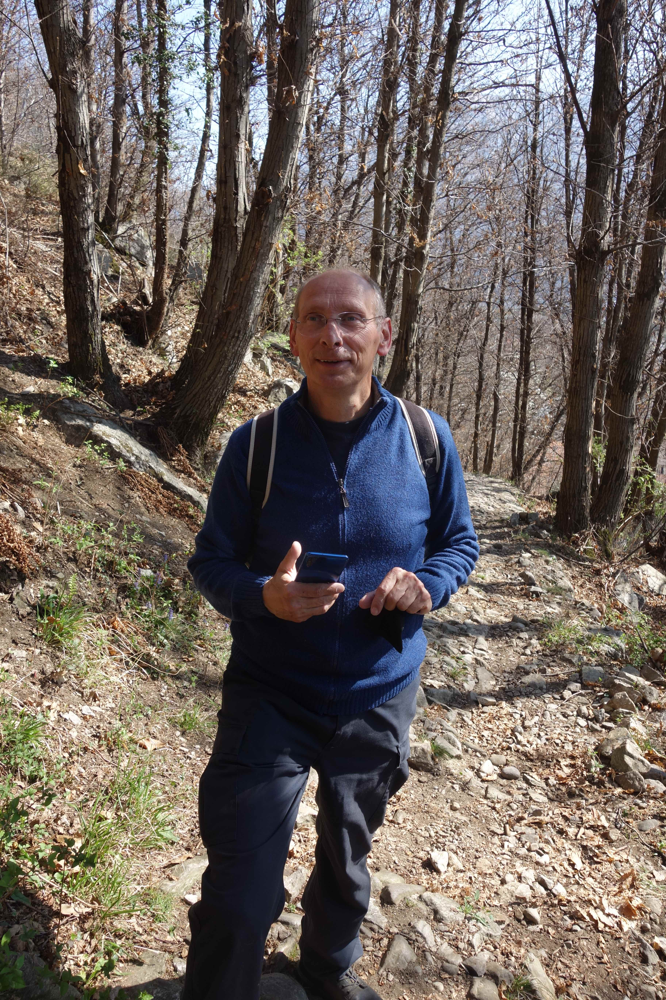 
<em> op weg naar boven </em>

En Fido vindt altijd water! Ik denk zelfs in een woestijn...

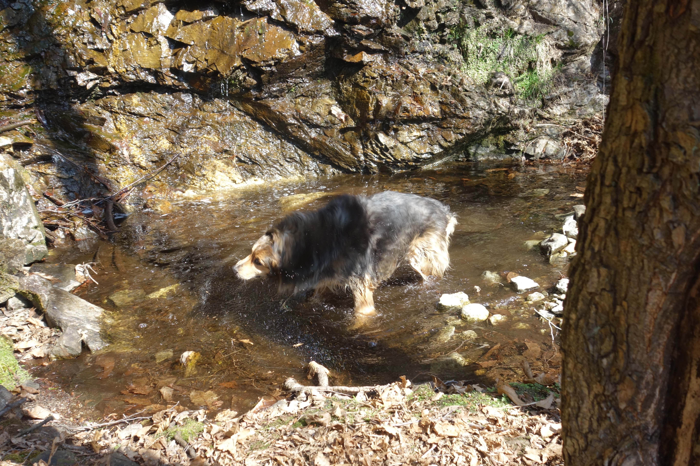 
<em> efkes weer in bad </em>

Naarmate we stijgen krijgen we een mooier uitzicht over het Ortameer, nu een keer van de andere kant.

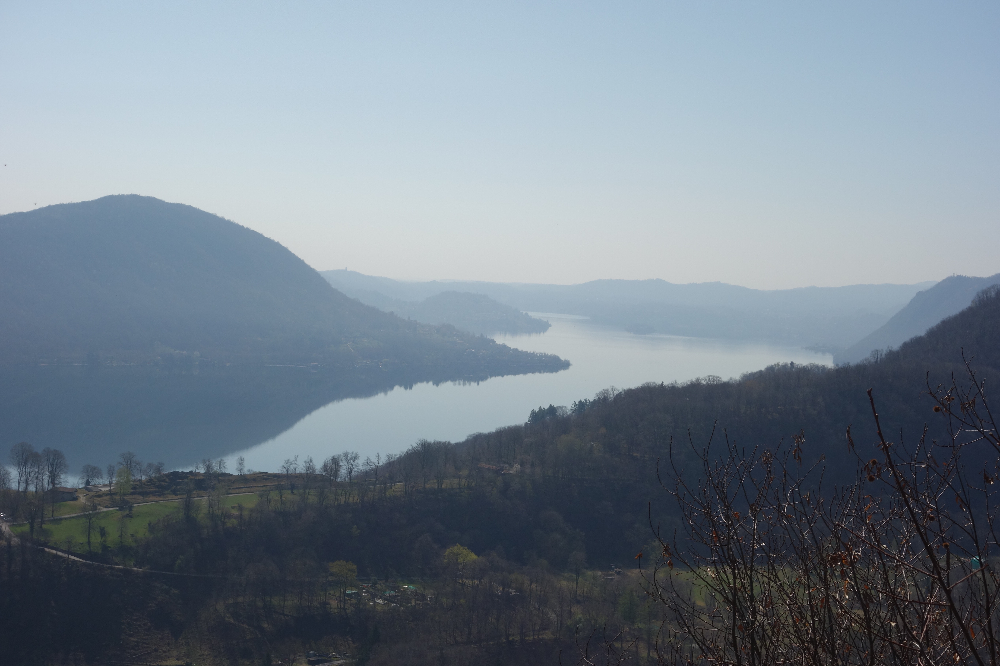 
<em> uitzicht op het meer </em>

Omdat het pad zeer steil is en Marion langzaam naar boven komt, loopt Fido vooruit en kijkt elke keer of we wel volgen...

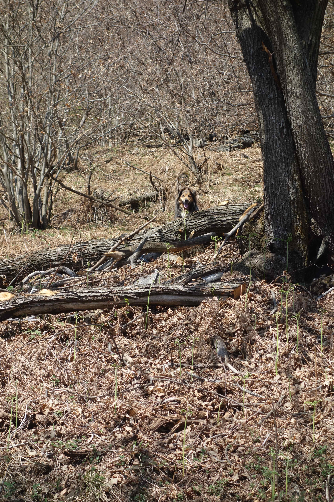 
<em> zoekplaatje </em>

we komen uiteindelijk aan bij het Oratorio del Fontegno, waar we wat eten en drinken en van het uitzicht genieten.

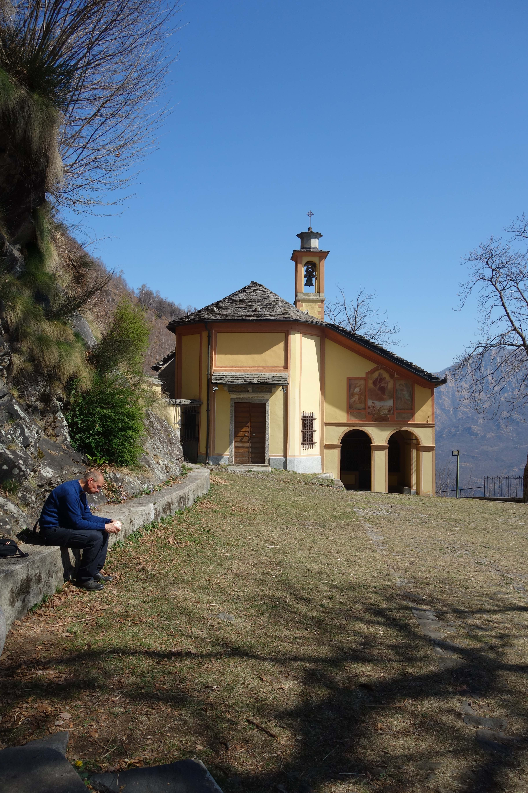 
<em> Het oratorio del Fontegno </em>

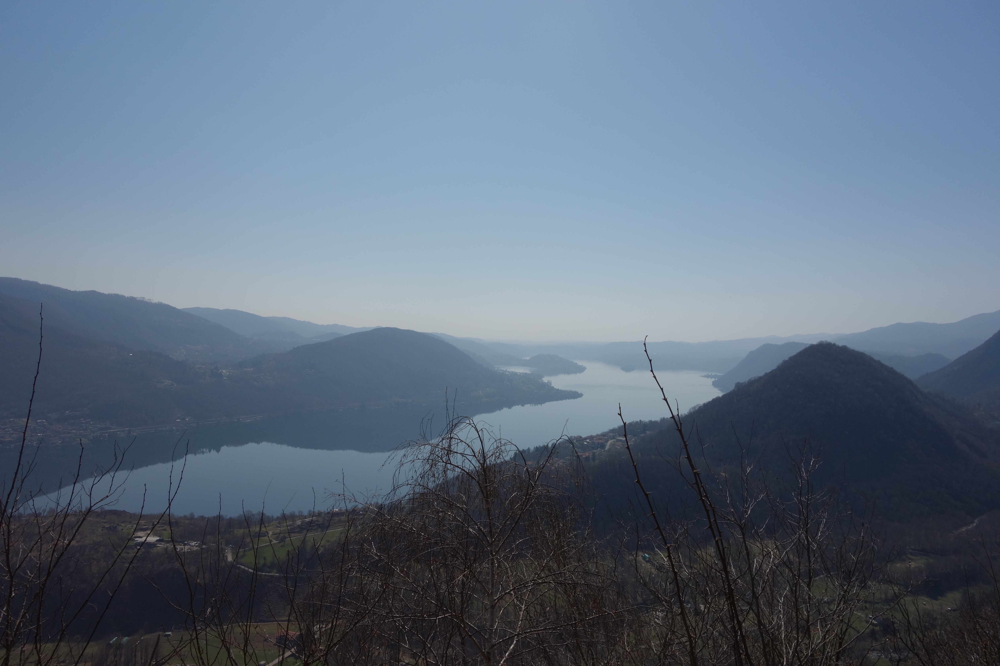 
<em> uitzicht op het meer vanuit het oratorio </em>

We vullen ons fles met "heilig" water uit de bron en gaan verder omhoog. 

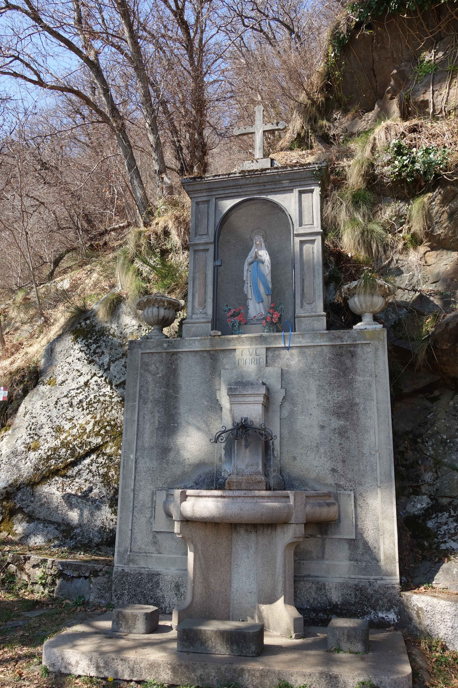 
<em> bronwater </em>

We komen langs gedenktekens over gebeurtenissen uit het leven van Maria. En we ervaren zelf een Maria-verschijning!

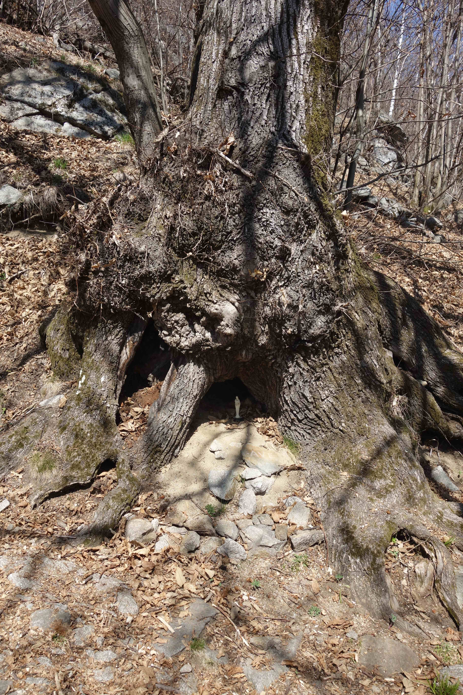 
<em> een heel klein Mariaatje... </em>

Helemaal boven lopen we naar het Belvedere, het uitzichtspunt.

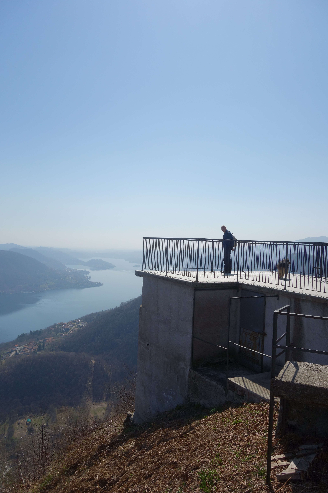 
<em> Kees en Fido lopen naar het uitzichtspunt </em>

en het uitzicht is geweldig!

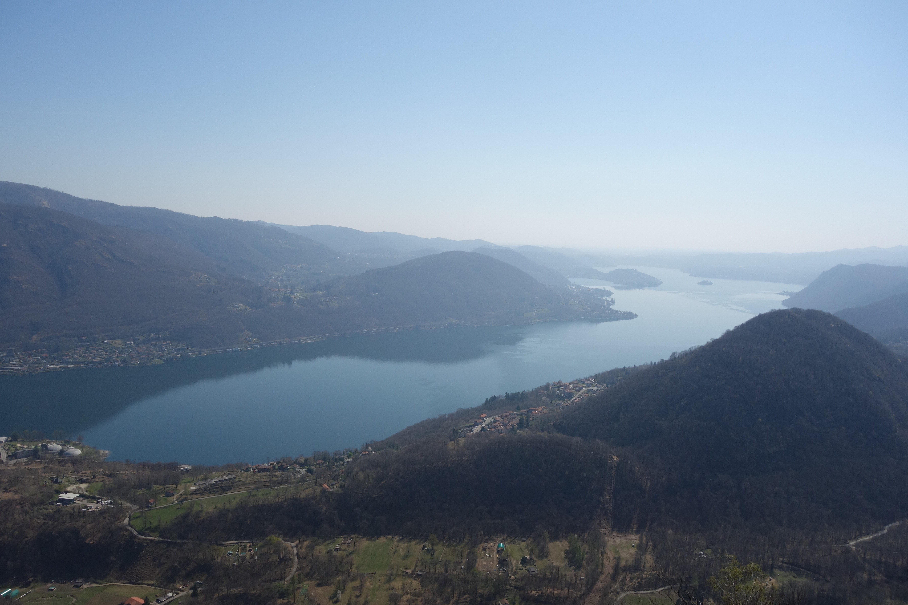 
<em> uitzicht op het meer </em>

We zien ook ons vertrekpunt: Cireggio en vlakbij de kerktoren zelfs Klaartje! (als je het weet)

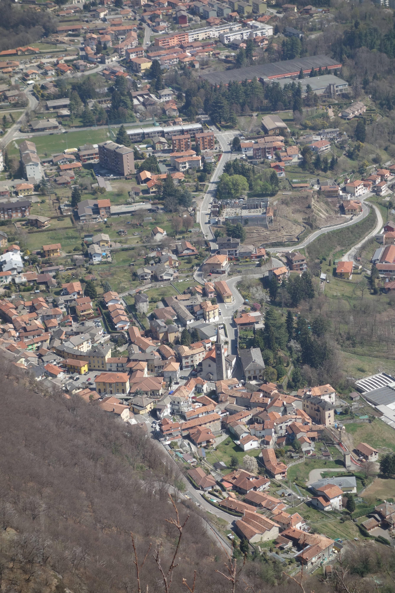 
<em> Cireggio </em>

Het valt ons op dat het hier boven erg stil is. Ondertussen is het ook flink warm!
We volgen de route naar Quarna Sopra, over de vrij rustige weg, en komen langs steeds meer muurschilderingen

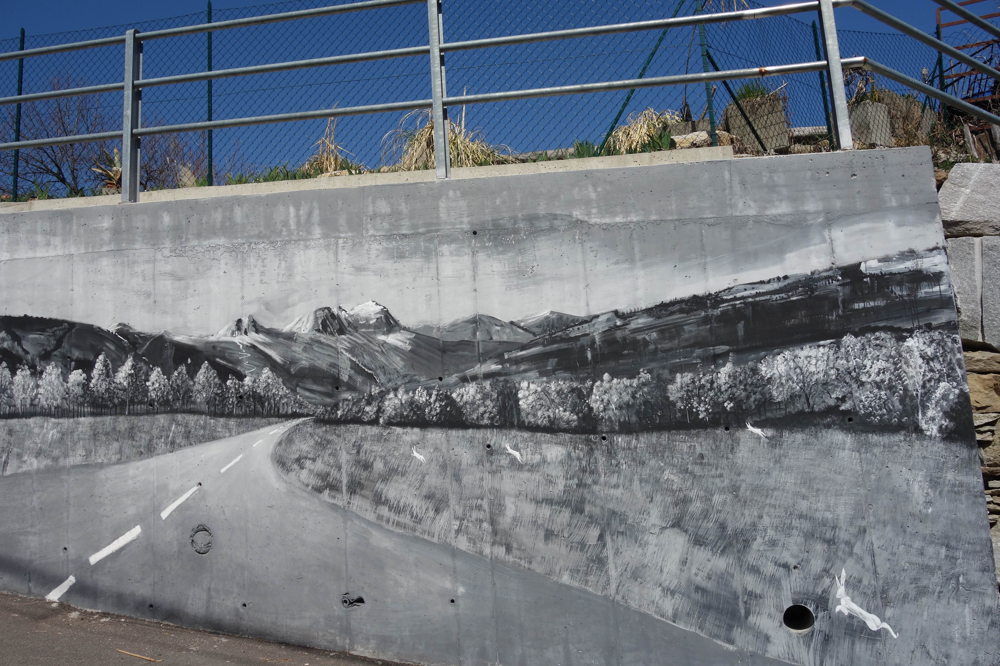 
<em> zomaar op een grauwe muur </em>

In het dorp zelf zien we er nog meer op de huizen.
